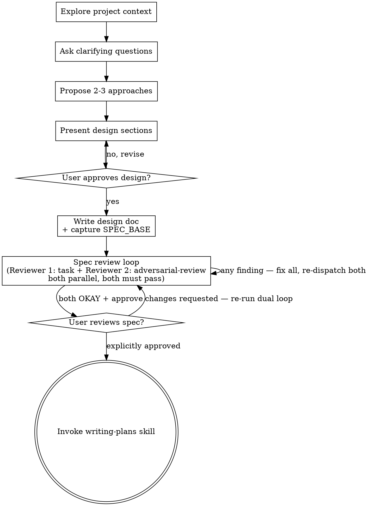
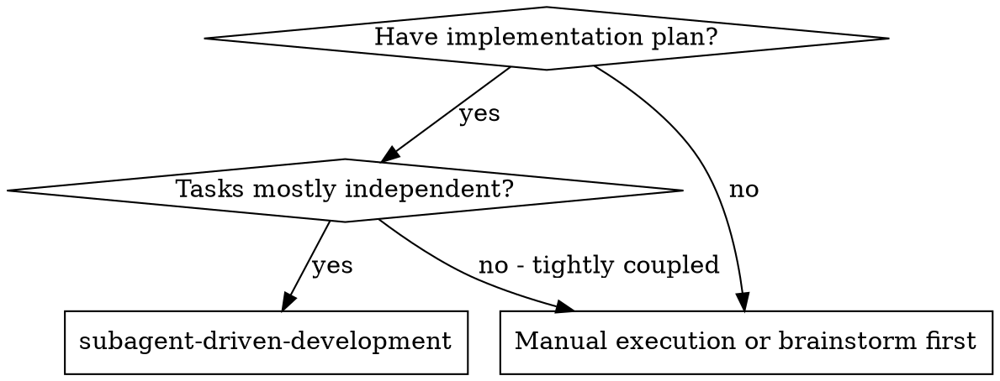
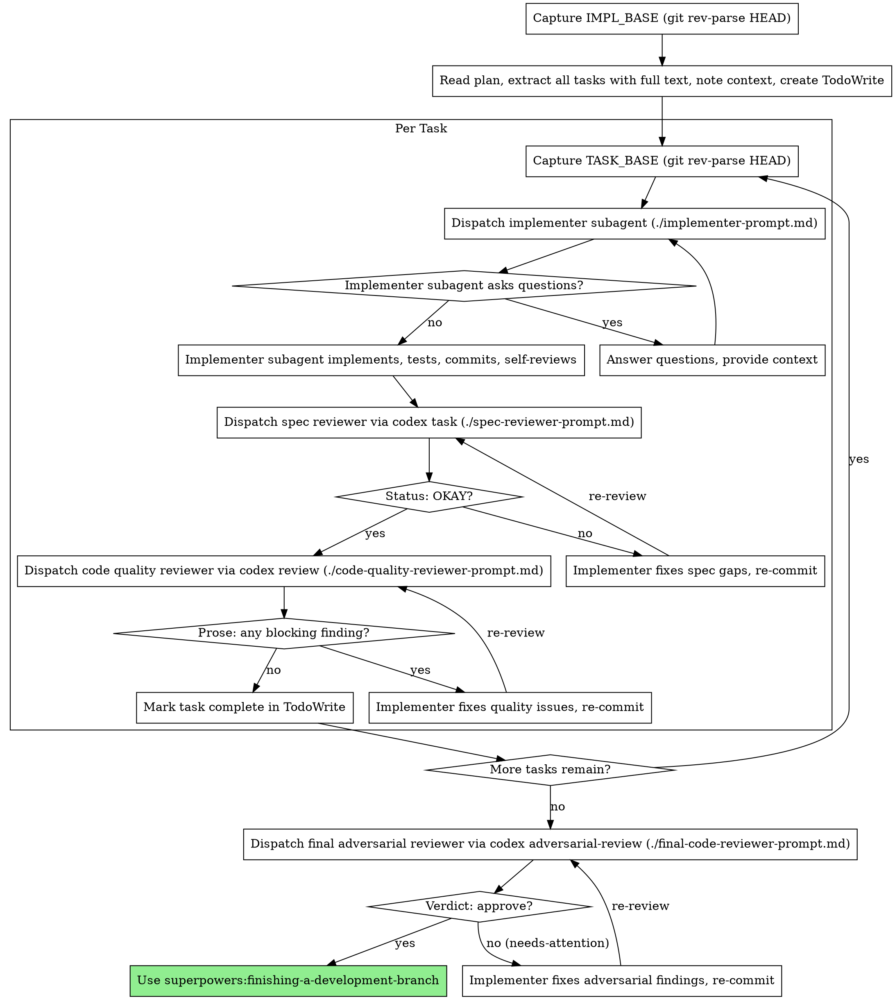

# Codex Reviewer Migration Implementation Plan

> **For agentic workers:** REQUIRED SUB-SKILL: Use superpowers:subagent-driven-development to implement this plan task-by-task. Steps use checkbox (`- [ ]`) syntax for tracking.

**Goal:** Migrate the review subagents in the brainstorming, writing-plans, and subagent-driven-development skills to run through the codex plugin companion instead of launching opus Claude subagents.

**Architecture:** Each of the 7 reviewers (1 Spec Document, 2 Adversarial Spec, 3 Per-Task, 4 Coverage, 5 Spec-Compliance, 6 Code-Quality, 7 Final) is rewritten to invoke `codex-companion.mjs` via one of three mechanisms — `task` (read-only custom prompt, verdict `Status: OKAY|Issues Found`), native `review` (free-form prose, parent interprets), or `adversarial-review` (structured `Verdict: approve|needs-attention`). The companion path is resolved at runtime (CLAUDE_PLUGIN_ROOT is not injected into skills). The brainstorming spec review becomes a dual-reviewer parallel round loop; writing-plans adopts a unified "changed-content re-runs + per-Task reviewer guards seams" round-loop policy.

**Tech Stack:** Markdown skill files; bash invocations of `node codex-companion.mjs`; git for base-SHA diffing.

**Source of truth:** This plan implements `docs/superpowers/specs/2026-06-14-codex-reviewer-migration-design.md`. Each task below contains the complete final file content — write it verbatim.

---

## File Structure

Files created or modified (all under `skills/`):

| Task | File | Action | Reviewer |
|---|---|---|---|
| 1 | `brainstorming/spec-document-reviewer-prompt.md` | Rewrite | 1 |
| 2 | `brainstorming/adversarial-spec-review-prompt.md` | **Create** | 2 |
| 3 | `brainstorming/SKILL.md` | Rewrite | — |
| 4 | `writing-plans/plan-document-reviewer-prompt.md` | Rewrite | 3 |
| 5 | `writing-plans/coverage-verifier-prompt.md` | Rewrite | 4 |
| 6 | `writing-plans/SKILL.md` | Rewrite | — |
| 7 | `subagent-driven-development/spec-reviewer-prompt.md` | Rewrite | 5 |
| 8 | `subagent-driven-development/code-quality-reviewer-prompt.md` | Rewrite | 6 |
| 9 | `subagent-driven-development/final-code-reviewer-prompt.md` | Rewrite | 7 |
| 10 | `subagent-driven-development/SKILL.md` | Rewrite | — |
| 11 | (none — operational smoke test) | Verify | — |

**Out of scope (do not modify):** `subagent-driven-development/implementer-prompt.md`, `finishing-a-development-branch/`, and `~/.claude/CLAUDE.md`.

**Shared invocation blocks:** Every reviewer that calls codex embeds the same companion path-resolution snippet (resolve newest cache version, fall back to marketplace, abort with a `/codex:setup` message if absent). This snippet is intentionally duplicated into each file (the repo vendors skills individually, so no cross-skill shared file). The exact snippet appears in each task's content below — write it verbatim.

**Notes on verification:** These are markdown skill files, not code with unit tests. Each task's verification uses `grep` assertions on the written file (presence of required markers, absence of forbidden ones). Run each from the repo root `/Users/stu43005/Sources/superpowers-codex`.

---

### Task 1: Rewrite Spec Document Reviewer (reviewer 1) to codex `task`

**Files:**
- Modify (full rewrite): `skills/brainstorming/spec-document-reviewer-prompt.md`

- [ ] **Step 1: Write the complete content below to `skills/brainstorming/spec-document-reviewer-prompt.md`**

`````markdown
# Spec Document Reviewer Prompt Template (Reviewer 1 — Structural Completeness)

Use this template when dispatching the structural completeness reviewer for a spec document.

**Purpose:** Verify the spec is complete, consistent, and ready for implementation planning.

**Dispatch after:** Spec document is written to `docs/superpowers/specs/` and committed.

**Mechanism:** codex companion `task` (read-only). No `--write` flag — Codex runs in read-only mode. The caller loops: if `Issues Found`, fix ALL issues and re-dispatch; repeat until Codex returns `Status: OKAY`.

## Invocation

```bash
# Step 1: Resolve companion path
CODEX_COMPANION="$(ls -d ~/.claude/plugins/cache/openai-codex/codex/*/scripts/codex-companion.mjs 2>/dev/null | sort -V | tail -1)"
[ -z "$CODEX_COMPANION" ] && CODEX_COMPANION="$HOME/.claude/plugins/marketplaces/openai-codex/plugins/codex/scripts/codex-companion.mjs"
if [ ! -f "$CODEX_COMPANION" ]; then
  echo "codex plugin not found; run /codex:setup. Do NOT fall back to inline self-review." >&2
  exit 1
fi

# Step 2: Write the review prompt to a temp file and dispatch
PROMPT_FILE="$(mktemp)"
cat > "$PROMPT_FILE" <<'PROMPT'
You are a spec document reviewer. Your job is to verify that the spec document at the path given below is structurally complete and ready for implementation planning. Read the file, then apply each check in the table below.

**Spec to review:** [SPEC_FILE_PATH]

## What to Check

| Category | What to Look For |
|----------|------------------|
| Placeholder scan | "TBD", "TODO", blank sections, or vague requirements that are not actionable |
| Internal consistency | Sections that contradict each other; architecture descriptions that do not match feature descriptions |
| Scope check | Focused enough for a single implementation plan — not spanning multiple independent subsystems; if too broad, flag for decomposition |
| Ambiguity check | Any requirement that could be interpreted two different ways; if so, it must be made explicit |
| YAGNI | Unrequested features, over-engineering |

## Calibration

Only flag issues that would cause real problems during implementation planning.
A missing section, a contradiction, or a requirement so ambiguous it could be
interpreted two different ways — those are issues. Minor wording improvements,
stylistic preferences, and "sections less detailed than others" are not.

Approve unless there are serious gaps that would lead to a flawed plan.

## Output Format

Your response MUST end with exactly one of these two final lines (the last line of your entire response):

    Status: OKAY

or

    Status: Issues Found

If issues are found, list each one before the final Status line using this format:

**Issues:**
- [Section/area]: [specific issue] — [why it matters for planning]

**Recommendations (advisory, do not block approval):**
- [suggestions for improvement that should NOT appear in Issues]
PROMPT
node "$CODEX_COMPANION" task --prompt-file "$PROMPT_FILE"
rm -f "$PROMPT_FILE"
```

**Verdict parsing:** The caller reads the final `Status:` line of Codex output.
- `Status: OKAY` → spec passes this reviewer; proceed.
- `Status: Issues Found` → fix every listed issue, re-run this invocation for the next round.
`````

- [ ] **Step 2: Verify required markers present and opus framing removed**

Run:
```bash
cd /Users/stu43005/Sources/superpowers-codex
grep -c "CODEX_COMPANION" skills/brainstorming/spec-document-reviewer-prompt.md
grep -c "task --prompt-file" skills/brainstorming/spec-document-reviewer-prompt.md
grep -c "Status: OKAY" skills/brainstorming/spec-document-reviewer-prompt.md
grep -in "opus model\|Task tool (general-purpose" skills/brainstorming/spec-document-reviewer-prompt.md || echo "NO_OPUS_FRAMING"
```
Expected: first three counts each `>= 1`; last line prints `NO_OPUS_FRAMING`.

- [ ] **Step 3: Commit**

```bash
git add skills/brainstorming/spec-document-reviewer-prompt.md
git commit -m "feat(brainstorming): run spec document reviewer via codex task"
```

---

### Task 2: Create Adversarial Spec Review template (reviewer 2)

**Files:**
- Create: `skills/brainstorming/adversarial-spec-review-prompt.md`

- [ ] **Step 1: Write the complete content below to `skills/brainstorming/adversarial-spec-review-prompt.md`**

`````markdown
# Adversarial Spec Review Prompt Template (Reviewer 2 — Design Soundness)

Use this template when dispatching the adversarial design reviewer for a spec document.

**Purpose:** Challenge the design-level soundness and completeness of a not-yet-implemented spec. This reviewer is adversarial — it attacks assumptions, failure paths, and edge cases at the design level. It does NOT do line-by-line structural checks (that is Reviewer 1's job).

**Dispatch after:** Spec document is written and committed. Run in parallel with Reviewer 1 each round.

**Mechanism:** codex companion `adversarial-review --base <SPEC_BASE>`. The diff reviewed is the new spec commit (everything since `SPEC_BASE`). The caller loops: if `needs-attention`, fix ALL findings and re-dispatch both reviewers; repeat until this reviewer returns `approve` AND Reviewer 1 returns `OKAY`.

## Capturing SPEC_BASE

`SPEC_BASE` must be captured **before** writing or committing the spec file — it is the HEAD at that moment (the parent commit of the spec commit). Capture it with:

```bash
SPEC_BASE="$(git rev-parse HEAD)"
```

Run this line immediately before writing the spec file. Store `SPEC_BASE` for use in all subsequent rounds of this reviewer. Do NOT re-capture it after the spec commit — it must remain the direct ancestor of the spec commit so that `adversarial-review --base <SPEC_BASE>` diffs exactly the new spec content.

If the spec file is gitignored and cannot be committed, skip this reviewer for this round and note the skip in your output (consistent with the git commit discipline: never use `git add -f`).

## Invocation

```bash
# Step 1: Resolve companion path
CODEX_COMPANION="$(ls -d ~/.claude/plugins/cache/openai-codex/codex/*/scripts/codex-companion.mjs 2>/dev/null | sort -V | tail -1)"
[ -z "$CODEX_COMPANION" ] && CODEX_COMPANION="$HOME/.claude/plugins/marketplaces/openai-codex/plugins/codex/scripts/codex-companion.mjs"
if [ ! -f "$CODEX_COMPANION" ]; then
  echo "codex plugin not found; run /codex:setup. Do NOT fall back to inline self-review." >&2
  exit 1
fi

# Step 2: Dispatch adversarial review against the spec diff
node "$CODEX_COMPANION" adversarial-review --base "$SPEC_BASE" --wait "Focus on design-level soundness and completeness of this not-yet-implemented spec. Challenge: (1) failure paths, partial failure, and rollback — what happens when any step fails mid-way; (2) concurrency and ordering assumptions — are there implicit sequencing requirements that are never stated; (3) boundary and empty states — zero items, maximum limits, empty input, first-run with no prior state; (4) compatibility and migration risk — does this design interact with existing data, APIs, or systems in ways that could break them; (5) unstated but critical assumptions — what must be true in the environment, dependencies, or caller behaviour for this design to work. Report only material design-level findings. Do not perform line-by-line wording review."
```

**Verdict parsing:** The caller reads the `Verdict:` line from Codex output.
- `Verdict: approve` → spec passes this reviewer; proceed.
- `Verdict: needs-attention` → fix every listed finding, then re-run BOTH Reviewer 1 and Reviewer 2 for the next round (both reviewers re-run together whenever any spec edit is made).
`````

- [ ] **Step 2: Verify**

Run:
```bash
cd /Users/stu43005/Sources/superpowers-codex
grep -c "adversarial-review --base" skills/brainstorming/adversarial-spec-review-prompt.md
grep -c "SPEC_BASE=\"\$(git rev-parse HEAD)\"" skills/brainstorming/adversarial-spec-review-prompt.md
grep -c "Verdict: approve" skills/brainstorming/adversarial-spec-review-prompt.md
```
Expected: each count `>= 1`.

- [ ] **Step 3: Commit**

```bash
git add skills/brainstorming/adversarial-spec-review-prompt.md
git commit -m "feat(brainstorming): add adversarial spec review template (reviewer 2)"
```

---

### Task 3: Rewrite brainstorming SKILL.md to dual-reviewer round loop

**Files:**
- Modify (full rewrite): `skills/brainstorming/SKILL.md`

- [ ] **Step 1: Write the complete content below to `skills/brainstorming/SKILL.md`**

`````markdown
---
name: brainstorming
description: "You MUST use this before any creative work - creating features, building components, adding functionality, or modifying behavior. Explores user intent, requirements and design before implementation."
---

# Brainstorming Ideas Into Designs

Help turn ideas into fully formed designs and specs through natural collaborative dialogue.

Start by understanding the current project context, then ask questions one at a time to refine the idea. Once you understand what you're building, present the design and get user approval.

<HARD-GATE>
Do NOT invoke any implementation skill, write any code, scaffold any project, or take any implementation action until you have presented a design and the user has approved it. This applies to EVERY project regardless of perceived simplicity.
</HARD-GATE>

## Anti-Pattern: "This Is Too Simple To Need A Design"

Every project goes through this process. A todo list, a single-function utility, a config change — all of them. "Simple" projects are where unexamined assumptions cause the most wasted work. The design can be short (a few sentences for truly simple projects), but you MUST present it and get approval.

## Checklist

You MUST create a task for each of these items and complete them in order:

1. **Explore project context** — check files, docs, recent commits
2. **Ask clarifying questions** — one at a time, understand purpose/constraints/success criteria
3. **Propose 2-3 approaches** — with trade-offs and your recommendation
4. **Present design** — in sections scaled to their complexity, get user approval after each section
5. **Write design doc** — save to `docs/superpowers/specs/YYYY-MM-DD-<topic>-design.md` and commit
6. **Spec review loop (dual reviewer, codex)** — capture `SPEC_BASE` before writing the spec; after committing, dispatch Reviewer 1 (`task`, structural completeness) and Reviewer 2 (`adversarial-review`, design soundness) in parallel each round; fix ALL findings; loop until Reviewer 1 returns `Status: OKAY` AND Reviewer 2 returns `Verdict: approve` in the same round (see below — do NOT do this inline)
7. **User reviews written spec** — ask user to review the spec file before proceeding; if changes requested, fix them and re-run the dual review loop (step 6) until both pass, then wait for explicit approval
8. **Transition to implementation** — invoke writing-plans skill to create implementation plan (this is the ONLY next step; never jump straight to code)

## Process Flow



**The terminal state is invoking writing-plans.** Do NOT invoke frontend-design, mcp-builder, or any other implementation skill. The ONLY skill you invoke after brainstorming is writing-plans.

## The Process

**Understanding the idea:**

- Check out the current project state first (files, docs, recent commits)
- Before asking detailed questions, assess scope: if the request describes multiple independent subsystems (e.g., "build a platform with chat, file storage, billing, and analytics"), flag this immediately. Don't spend questions refining details of a project that needs to be decomposed first.
- If the project is too large for a single spec, help the user decompose into sub-projects: what are the independent pieces, how do they relate, what order should they be built? Then brainstorm the first sub-project through the normal design flow. Each sub-project gets its own spec → plan → implementation cycle.
- For appropriately-scoped projects, ask questions one at a time to refine the idea
- Prefer multiple choice questions when possible, but open-ended is fine too
- Only one question per message - if a topic needs more exploration, break it into multiple questions
- Focus on understanding: purpose, constraints, success criteria

**Exploring approaches:**

- Propose 2-3 different approaches with trade-offs
- Present options conversationally with your recommendation and reasoning
- Lead with your recommended option and explain why

**Presenting the design:**

- Once you believe you understand what you're building, present the design
- Scale each section to its complexity: a few sentences if straightforward, up to 200-300 words if nuanced
- Ask after each section whether it looks right so far
- Cover: architecture, components, data flow, error handling, testing
- Be ready to go back and clarify if something doesn't make sense

**Design for isolation and clarity:**

- Break the system into smaller units that each have one clear purpose, communicate through well-defined interfaces, and can be understood and tested independently
- For each unit, you should be able to answer: what does it do, how do you use it, and what does it depend on?
- Can someone understand what a unit does without reading its internals? Can you change the internals without breaking consumers? If not, the boundaries need work.
- Smaller, well-bounded units are also easier for you to work with - you reason better about code you can hold in context at once, and your edits are more reliable when files are focused. When a file grows large, that's often a signal that it's doing too much.

**Working in existing codebases:**

- Explore the current structure before proposing changes. Follow existing patterns.
- Where existing code has problems that affect the work (e.g., a file that's grown too large, unclear boundaries, tangled responsibilities), include targeted improvements as part of the design - the way a good developer improves code they're working in.
- Don't propose unrelated refactoring. Stay focused on what serves the current goal.

## After the Design

**Documentation:**

- Write the validated design (spec) to `docs/superpowers/specs/YYYY-MM-DD-<topic>-design.md`
  - (User preferences for spec location override this default)
- Use elements-of-style:writing-clearly-and-concisely skill if available
- Commit the design document to git

**Spec Review Loop (Dual Reviewer, codex companion):**

Do NOT perform inline self-review. After writing and committing the spec document, dispatch **two reviewers in parallel** using the codex companion. Both reviewers examine the same spec document; both must pass before proceeding.

**Before writing the spec file**, capture `SPEC_BASE`:

```bash
SPEC_BASE="$(git rev-parse HEAD)"
```

Store this value — it is the parent commit of the spec commit and must not change across rounds.

**Reviewer 1 — Structural Completeness** (`task`, read-only):
Uses `spec-document-reviewer-prompt.md`. Checks: placeholder scan, internal consistency, scope check, ambiguity check, YAGNI. Returns `Status: OKAY` or `Status: Issues Found`.

**Reviewer 2 — Design Soundness** (`adversarial-review`):
Uses `adversarial-spec-review-prompt.md`. Challenges design-level soundness: failure paths / partial failure / rollback, concurrency and ordering assumptions, boundary and empty states, compatibility / migration risk, unstated critical assumptions. Returns `Verdict: approve` or `Verdict: needs-attention`.

**Parallel dispatch per round:**

Both reviewers are launched simultaneously each round as separate background Bash calls (`run_in_background: true`), each running `node <companion> <subcommand> ...`. Collect both outputs before evaluating results.

**Round loop — zero tolerance:**

```
while true:
  [launch Reviewer 1 and Reviewer 2 in parallel, wait for both]
  if reviewer1 == "Status: OKAY" AND reviewer2 == "Verdict: approve":
    break  # both passed — exit loop
  fix_all_findings(reviewer1.issues + reviewer2.findings)  # every finding — none skipped
  # spec was edited — re-dispatch BOTH reviewers next round
  # (both re-run together whenever any spec edit is made)
```

Any finding from either reviewer blocks the round. Fix everything before re-dispatching.

**Git commit discipline:** Before the first review round, commit the first version of the spec. After each round's fixes, commit again with a message noting the round (e.g. `docs(spec): fix review round 2 - resolve ambiguity in auth flow`). If the spec file is gitignored, skip the commit — NEVER use `git add -f` to force-add an ignored file. If the spec is gitignored, Reviewer 2 cannot diff the spec commit and must be skipped for that round (note the skip in output).

**User Review Gate:**

After the dual review loop reports both OKAY and approve, ask the user to review the written spec before proceeding:

> "Spec written and committed to `<path>`. Please review it and let me know if you want to make any changes before we start writing out the implementation plan."

Wait for the user's response. If they request changes:

1. Make the requested changes.
2. Re-run the dual spec review loop (both Reviewer 1 and Reviewer 2 in parallel, until both pass). If the change affects global consistency or scope, the full spec is re-reviewed; if it only affects a single section, the review may focus there — but both reviewers still re-run.
3. Commit the fixes (with a round-labeled commit message).
4. Report the changes back to the user and wait for their next reply.

Only leave this gate and proceed to writing-plans once the user **explicitly approves** (e.g. "OK", "looks good", "start the plan"). Do not proceed on ambiguous or silent responses.

**Implementation:**

The mandatory workflow sequence is **brainstorming → spec document → writing-plans → plan document → implementation**, in strict order. Never jump from brainstorming straight to code, and never skip the spec or plan stages — even for "simple" tasks.

- Invoke the writing-plans skill to create a detailed implementation plan.
- Do NOT invoke any other skill. writing-plans is the ONLY next step after brainstorming.

## Key Principles

- **One question at a time** - Don't overwhelm with multiple questions
- **Multiple choice preferred** - Easier to answer than open-ended when possible
- **YAGNI ruthlessly** - Remove unnecessary features from all designs
- **Explore alternatives** - Always propose 2-3 approaches before settling
- **Incremental validation** - Present design, get approval before moving on
- **Be flexible** - Go back and clarify when something doesn't make sense
`````

- [ ] **Step 2: Verify dual-reviewer loop present and single-opus-subagent framing removed**

Run:
```bash
cd /Users/stu43005/Sources/superpowers-codex
grep -c "Dual Reviewer" skills/brainstorming/SKILL.md
grep -c "adversarial-spec-review-prompt.md" skills/brainstorming/SKILL.md
grep -c "SPEC_BASE" skills/brainstorming/SKILL.md
grep -in "dispatch an independent review subagent\|opus model" skills/brainstorming/SKILL.md || echo "NO_OPUS_SUBAGENT"
```
Expected: first three counts `>= 1`; last prints `NO_OPUS_SUBAGENT`.

- [ ] **Step 3: Commit**

```bash
git add skills/brainstorming/SKILL.md
git commit -m "feat(brainstorming): dual-reviewer codex spec review loop"
```

---

### Task 4: Rewrite Per-Task Reviewer (reviewer 3) to codex `task` with sibling context

**Files:**
- Modify (full rewrite): `skills/writing-plans/plan-document-reviewer-prompt.md`

- [ ] **Step 1: Write the complete content below to `skills/writing-plans/plan-document-reviewer-prompt.md`**

`````markdown
# Plan Document Reviewer Prompt Template

Use this template when dispatching a per-Task plan document reviewer via the codex companion.

**Purpose:** Verify that one specific Task in the plan is complete, internally consistent, and ready for an implementer to execute without ambiguity. When reviewing a Task that was edited this round, also guard the integration seams: check that the changed Task's types, naming, and interfaces remain consistent with all sibling Tasks — catching "a change in Task A breaks already-passed Task B" without needing to re-review B directly.

**Dispatch:** One codex `task` call per Task (read-only). The caller loops — re-dispatching for a Task — until this reviewer returns `Status: OKAY` for that Task.

## How to Dispatch

```bash
# Resolve codex companion path
CODEX_COMPANION="$(ls -d ~/.claude/plugins/cache/openai-codex/codex/*/scripts/codex-companion.mjs 2>/dev/null | sort -V | tail -1)"
[ -z "$CODEX_COMPANION" ] && CODEX_COMPANION="$HOME/.claude/plugins/marketplaces/openai-codex/plugins/codex/scripts/codex-companion.mjs"
if [ ! -f "$CODEX_COMPANION" ]; then
  echo "codex plugin not found; run /codex:setup. Do NOT fall back to inline self-review." >&2
  exit 1
fi

PROMPT_FILE="$(mktemp)"
cat > "$PROMPT_FILE" <<'PROMPT'
You are an independent plan Task reviewer executed by the codex companion. You must use
rigorous judgment. Do not approve a Task that has real problems just to avoid friction.

**Task to review:** [PASTE THE FULL TEXT OF THE SINGLE TASK HERE]

**Sibling Tasks (all other Tasks in the plan — for cross-Task consistency checking):**
[PASTE THE FULL TEXT OF ALL OTHER TASKS HERE]

**Spec file path:** [SPEC_FILE_PATH]
Read the spec file in full before proceeding.

## What to Check

Review the Task under review against ALL seven criteria below. Flag any issue that would
cause an implementer to build the wrong thing, get stuck, or produce inconsistent code.

**1. Spec Coverage**
Does this Task correctly implement its corresponding spec requirement(s)?
Map every step back to a spec section. Flag any step that contradicts the spec
or any spec requirement assigned to this Task that is not addressed.

**2. Placeholder Scan**
Search for vague filler that leaves real decisions to the implementer:
- "TBD", "TODO", "implement later", "fill in details"
- "Add appropriate error handling" / "add validation" / "handle edge cases" (without showing the actual code)
- "Write tests for the above" (without actual test code)
- "Similar to Task N" (the implementer may be executing Tasks out of order)
- Any step that describes *what* to do without showing *how* (code blocks are required for code steps)
- References to types, functions, or methods not defined anywhere in the plan

**3. Type Consistency and Cross-Task Integration Seams**
Are types, method signatures, and property names consistent between this Task and all
sibling Tasks? A function named `clearLayers()` in this Task but `clearFullLayers()` in
another Task is a latent bug. Flag every mismatch.

When this Task was edited (i.e., you are re-reviewing it after a fix), you MUST
additionally check whether the edit introduced any inconsistency or broken integration
seam with the sibling Tasks provided in context. This covers the case where a change
in this Task could break an already-passed sibling Task — you are responsible for
catching that here so sibling Tasks do not need to be re-reviewed solely for this reason.
Flag every such cross-Task breakage found.

**4. Code Completeness**
Every step that changes or creates code must contain the actual code — not a
description of what the code should do. A step like "implement the parser" with
no code block is a plan failure.

**5. Command Accuracy**
Every command must be complete and correct (right flags, right paths, right tool).
Expected output must be plausible and specific. "Expected: PASS" is acceptable;
"Expected: it works" is not.

**6. Document Reference Leak**
Code blocks and inline code comments must not reference the spec or plan documents
themselves. Examples of forbidden references:
- "per design spec §1-4"
- "see plan Task 2"
- "as described in the spec"
- "according to the implementation plan"
Code must be self-explanatory. Remove every such reference.

**7. Pre-Implementation Research Task Leak**
The plan must not contain steps or tasks that merely verify third-party library or
API behavior before implementation begins. Such research must happen *before* the
plan is written — deferring it to the implementer is a plan failure.

Forbidden examples:
- "Verify that library X's Y method accepts Z parameter"
- "Confirm the semantics of Z API call"
- "Check whether package W supports feature V"

**Distinguishing rule:** If the question can be answered by reading docs or source
code right now, it is pre-implementation research and is forbidden in the plan.
If it can only be answered by running against a real system after implementation
(e.g. `getIndexes()`, `EXPLAIN`, slow-query log, APM metrics, smoke tests,
migration before/after comparison), it is legitimate operational verification and
must NOT be removed.

## Calibration

Only flag issues that would cause real problems during implementation.
Minor wording preferences and style suggestions are not issues.
Approve a Task only when all seven criteria pass AND no cross-Task seam breakage
was found.

## Output Format

### Task [N] Review

**Issues (if any):**
- [Criterion]: [specific issue at Step X] — [why it matters for implementation]

**Recommendations (advisory, do not block approval):**
- [suggestions for improvement that do not constitute blockers]

Your final line MUST be exactly one of:
Status: OKAY
Status: Issues Found
PROMPT
node "$CODEX_COMPANION" task --prompt-file "$PROMPT_FILE"
rm -f "$PROMPT_FILE"
```

**Reviewer returns:** A final line of `Status: OKAY` or `Status: Issues Found`. The parent parses this line to drive the loop.

**Parallel dispatch within a round:** Each per-Task reviewer for Tasks active in the current round is launched as a separate Bash call with `run_in_background: true`. Results are collected via BashOutput polling after all background calls have been dispatched.
`````

- [ ] **Step 2: Verify**

Run:
```bash
cd /Users/stu43005/Sources/superpowers-codex
grep -c "Sibling Tasks" skills/writing-plans/plan-document-reviewer-prompt.md
grep -c "Cross-Task Integration Seams" skills/writing-plans/plan-document-reviewer-prompt.md
grep -c "task --prompt-file" skills/writing-plans/plan-document-reviewer-prompt.md
grep -c "Status: OKAY" skills/writing-plans/plan-document-reviewer-prompt.md
```
Expected: each count `>= 1`.

- [ ] **Step 3: Commit**

```bash
git add skills/writing-plans/plan-document-reviewer-prompt.md
git commit -m "feat(writing-plans): run per-task reviewer via codex task with sibling context"
```

---

### Task 5: Rewrite Coverage Verifier (reviewer 4) to codex `task`

**Files:**
- Modify (full rewrite): `skills/writing-plans/coverage-verifier-prompt.md`

- [ ] **Step 1: Write the complete content below to `skills/writing-plans/coverage-verifier-prompt.md`**

`````markdown
# Coverage Verifier Prompt Template

Use this template when dispatching a coverage verifier via the codex companion.

**Purpose:** Verify that the **whole plan** covers the **whole spec** — a global coverage check across all Tasks, not a per-Task review. This catches gaps that per-Task reviewers miss because they only see one Task at a time.

**Dispatch:** One codex `task` call (read-only), dispatched in parallel with the per-Task reviewers in each round. The caller loops — re-dispatching the Coverage Verifier — only if it returned coverage gaps that were then fixed. If it returned `Status: OKAY`, it drops out of subsequent rounds and does not re-run merely because some Task was changed (cross-Task consistency is the Per-Task reviewer's responsibility).

## How to Dispatch

```bash
# Resolve codex companion path
CODEX_COMPANION="$(ls -d ~/.claude/plugins/cache/openai-codex/codex/*/scripts/codex-companion.mjs 2>/dev/null | sort -V | tail -1)"
[ -z "$CODEX_COMPANION" ] && CODEX_COMPANION="$HOME/.claude/plugins/marketplaces/openai-codex/plugins/codex/scripts/codex-companion.mjs"
if [ ! -f "$CODEX_COMPANION" ]; then
  echo "codex plugin not found; run /codex:setup. Do NOT fall back to inline self-review." >&2
  exit 1
fi

PROMPT_FILE="$(mktemp)"
cat > "$PROMPT_FILE" <<'PROMPT'
You are an independent coverage verifier executed by the codex companion. You must use
rigorous judgment. Your job is to compare the ENTIRE plan against the ENTIRE spec and
identify anything in the spec that the plan fails to cover, silently changes, or weakens.

**Plan file path:** [PLAN_FILE_PATH]
**Spec file path:** [SPEC_FILE_PATH]

Read both files in full before proceeding.

## What to Check

**1. Spec Requirements — Item by Item**
List every functional requirement, described behavior, and acceptance criterion in
the spec. For each one, identify which Task(s) in the plan implement it. If a
requirement has no corresponding Task, list it as a coverage gap.

**2. Design Decisions — Item by Item**
List every design decision in the spec: architecture choices, data structures, API
shapes, error-handling strategy, dependency selections, performance constraints,
security requirements, compatibility constraints. For each one, confirm it is
realized in the plan. Flag anything that is:
- Missing entirely (no Task addresses it)
- Silently changed (the plan makes a different choice without acknowledging it)
- Weakened (the plan addresses it partially or makes it optional when the spec requires it)

**3. Implicit Requirements and Edge Conditions**
Identify conditions phrased in the spec with "should", "must", "need", "avoid",
"must not", or equivalent. Confirm each has a corresponding implementation step
or verification step in the plan. List any that do not.

**4. Cross-Task Integration**
Identify spec requirements that are split across multiple Tasks. Confirm there is
an integration point — a Task, step, or test — that actually connects them.
Example failure: Task A defines a type and Task B uses it, but no Task imports or
wires them together. List any disconnected splits.

**5. Out-of-Scope Content**
Identify any work in the plan that has no corresponding requirement in the spec
(scope creep). List each item so the user can decide whether to keep it.

## Calibration

Only flag issues that represent real gaps, contradictions, or scope creep.
Minor wording differences and stylistic choices between the spec and plan are not gaps.
Approve only when every spec requirement and design decision is accounted for.

## Output Format

### Coverage Verification

**Coverage Gaps (if any):**
- [Spec section / requirement]: not covered — [which Task should address it, or suggest a new Task]

**Design Decision Gaps (if any):**
- [Spec decision]: missing / changed / weakened — [details]

**Implicit Requirement Gaps (if any):**
- [Condition from spec]: no corresponding step in plan — [details]

**Cross-Task Integration Gaps (if any):**
- [Requirements split across Tasks X and Y]: missing integration point — [details]

**Out-of-Scope Content (informational, does not block approval):**
- [Plan Task / step]: not traceable to any spec requirement — [details]

Your final line MUST be exactly one of:
Status: OKAY
Status: Issues Found
PROMPT
node "$CODEX_COMPANION" task --prompt-file "$PROMPT_FILE"
rm -f "$PROMPT_FILE"
```

**Reviewer returns:** A final line of `Status: OKAY` or `Status: Issues Found`. The parent parses this line to drive the loop.
`````

- [ ] **Step 2: Verify**

Run:
```bash
cd /Users/stu43005/Sources/superpowers-codex
grep -c "task --prompt-file" skills/writing-plans/coverage-verifier-prompt.md
grep -c "Status: OKAY" skills/writing-plans/coverage-verifier-prompt.md
grep -in "opus" skills/writing-plans/coverage-verifier-prompt.md || echo "NO_OPUS"
```
Expected: first two counts `>= 1`; last prints `NO_OPUS`.

- [ ] **Step 3: Commit**

```bash
git add skills/writing-plans/coverage-verifier-prompt.md
git commit -m "feat(writing-plans): run coverage verifier via codex task"
```

---

### Task 6: Rewrite writing-plans SKILL.md round loop and dispatch

**Files:**
- Modify (full rewrite): `skills/writing-plans/SKILL.md`

> Note: this file has a pre-existing uncommitted modification. The full content below is the authoritative new version — write it as-is, replacing whatever is on disk.

- [ ] **Step 1: Write the complete content below to `skills/writing-plans/SKILL.md`**

``````markdown
---
name: writing-plans
description: Use when you have a spec or requirements for a multi-step task, before touching code
---

# Writing Plans

## Overview

Write comprehensive implementation plans assuming the engineer has zero context for our codebase and questionable taste. Document everything they need to know: which files to touch for each task, code, testing, docs they might need to check, how to test it. Give them the whole plan as bite-sized tasks. DRY. YAGNI. TDD. Frequent commits.

Assume they are a skilled developer, but know almost nothing about our toolset or problem domain. Assume they don't know good test design very well.

**Announce at start:** "I'm using the writing-plans skill to create the implementation plan."

**Save plans to:** `docs/superpowers/plans/YYYY-MM-DD-<feature-name>.md`
- (User preferences for plan location override this default)

## Scope Check

If the spec covers multiple independent subsystems, it should have been broken into sub-project specs during brainstorming. If it wasn't, suggest breaking this into separate plans — one per subsystem. Each plan should produce working, testable software on its own.

## File Structure

Before defining tasks, map out which files will be created or modified and what each one is responsible for. This is where decomposition decisions get locked in.

- Design units with clear boundaries and well-defined interfaces. Each file should have one clear responsibility.
- You reason best about code you can hold in context at once, and your edits are more reliable when files are focused. Prefer smaller, focused files over large ones that do too much.
- Files that change together should live together. Split by responsibility, not by technical layer.
- In existing codebases, follow established patterns. If the codebase uses large files, don't unilaterally restructure - but if a file you're modifying has grown unwieldy, including a split in the plan is reasonable.

This structure informs the task decomposition. Each task should produce self-contained changes that make sense independently.

## Bite-Sized Task Granularity

**Each step is one action (2-5 minutes):**
- "Write the failing test" - step
- "Run it to make sure it fails" - step
- "Implement the minimal code to make the test pass" - step
- "Run the tests and make sure they pass" - step
- "Commit" - step

## Plan Document Header

**Every plan MUST start with this header:**

```markdown
# [Feature Name] Implementation Plan

> **For agentic workers:** REQUIRED SUB-SKILL: Use superpowers:subagent-driven-development to implement this plan task-by-task. Steps use checkbox (`- [ ]`) syntax for tracking.

**Goal:** [One sentence describing what this builds]

**Architecture:** [2-3 sentences about approach]

**Tech Stack:** [Key technologies/libraries]

---
```

## Task Structure

````markdown
### Task N: [Component Name]

**Files:**
- Create: `exact/path/to/file.py`
- Modify: `exact/path/to/existing.py:123-145`
- Test: `tests/exact/path/to/test.py`

- [ ] **Step 1: Write the failing test**

```python
def test_specific_behavior():
    result = function(input)
    assert result == expected
```

- [ ] **Step 2: Run test to verify it fails**

Run: `pytest tests/path/test.py::test_name -v`
Expected: FAIL with "function not defined"

- [ ] **Step 3: Write minimal implementation**

```python
def function(input):
    return expected
```

- [ ] **Step 4: Run test to verify it passes**

Run: `pytest tests/path/test.py::test_name -v`
Expected: PASS

- [ ] **Step 5: Commit**

```bash
git add tests/path/test.py src/path/file.py
git commit -m "feat: add specific feature"
```
````

## No Placeholders

Every step must contain the actual content an engineer needs. These are **plan failures** — never write them:
- "TBD", "TODO", "implement later", "fill in details"
- "Add appropriate error handling" / "add validation" / "handle edge cases"
- "Write tests for the above" (without actual test code)
- "Similar to Task N" (repeat the code — the engineer may be reading tasks out of order)
- Steps that describe what to do without showing how (code blocks required for code steps)
- References to types, functions, or methods not defined in any task

## Remember
- Exact file paths always
- Complete code in every step — if a step changes code, show the code
- Exact commands with expected output
- DRY, YAGNI, TDD, frequent commits

## Mandatory Workflow Sequence

The only permitted order is:

```
brainstorming → spec → writing-plans → plan → implementation
```

You **must** have a written, reviewed, user-approved plan before a single line of implementation code is touched. Never skip or abbreviate the plan step because the task "seems simple" or "only touches one file." If you ever catch yourself writing implementation code without a plan, **stop immediately** and return to this skill first.

## Plan Review Loop

After writing and saving the complete plan, do **not** perform an inline self-review. Instead, dispatch reviewers via the **codex companion** (`codex-companion.mjs`). There are two reviewer roles:

- **Per-Task reviewer (reviewer 3):** reviews one Task at a time using `plan-document-reviewer-prompt.md`, dispatched via `node <companion> task` (read-only).
- **Coverage Verifier (reviewer 4):** reviews the whole plan against the whole spec using `coverage-verifier-prompt.md`, dispatched via `node <companion> task` (read-only).

If the codex companion is not installed, stop and ask the user to run `/codex:setup`. Do not fall back to inline self-review or any other substitute.

### Unified Re-run Policy

Which reviewers run in each round is governed by these three principles:

1. **Changed content must be re-reviewed.** Any Task that was edited this round (to fix an issue or fill a coverage gap) re-enters per-Task review in the next round. A newly added Task enters per-Task review for the first time. A Task that was not touched this round and already holds `Status: OKAY` drops out — it does not run again.

2. **The Per-Task reviewer guards cross-Task seams.** When reviewing a changed Task A, the reviewer is given the full text of all sibling Tasks as context and must check whether A's changes introduced any type, naming, or integration inconsistency with those siblings. This means "a change in A could break already-passed B" is caught by A's reviewer — B does not need to be re-reviewed for that reason alone.

3. **The Coverage Verifier re-runs only when its own gaps were fixed.** If the Coverage Verifier returned `Status: OKAY`, it drops out for all subsequent rounds. It does NOT re-run merely because some Task was changed — cross-Task consistency is the Per-Task reviewer's responsibility (principle 2). It re-runs only if it previously reported coverage gaps that were then addressed.

Both cases of "fix A breaks B" are therefore covered:
- If B's content was edited → B re-enters per-Task review (principle 1).
- If B's content was not edited but A's change could break B → A's reviewer catches it (principle 2).

### Per-Task Review

For **each Task** in the plan, dispatch a per-Task reviewer using the template in `./plan-document-reviewer-prompt.md`. Each reviewer call receives the full text of the single Task under review plus the full text of all sibling Tasks as context.

A Task that has not yet received `Status: OKAY` gets a reviewer dispatched each round. A Task drops out of the loop once its reviewer reports `Status: OKAY` and its content is not edited again.

### Coverage Verifier

In **addition** to the per-Task reviews, dispatch one Coverage Verifier each round using the template in `./coverage-verifier-prompt.md`. It reads the whole plan file and whole spec file (read-only) and compares them globally.

If it returns coverage gaps, fill every gap: add Tasks, strengthen existing Tasks, or amend the spec. Any newly added or substantially changed Task re-enters per-Task review in the next round. The Coverage Verifier re-runs next round only if gaps were fixed this round.

### The Round Loop

Per-Task reviewers and the Coverage Verifier are dispatched **in parallel** within a round using separate Bash calls with `run_in_background: true`. Do not wait for all per-Task reviews to finish before launching the Coverage Verifier. Collect all results via BashOutput polling, fix all issues and gaps together, then start the next round.

The loop ends when, within a single round, every active Per-Task reviewer returns `Status: OKAY` and the Coverage Verifier (if still active) returns `Status: OKAY`.

```
# Unified re-run policy:
#   - active_tasks: Tasks under review this round (changed or never yet OKAY)
#   - coverage_active: True until Coverage Verifier reports OKAY with no gaps fixed this round
active_tasks = all plan tasks   # first round: every task
coverage_active = True

while True:
    # Dispatch in parallel
    task_results = parallel(
        [dispatch_task_reviewer(task, sibling_tasks=all_other_tasks) for task in active_tasks],
        dispatch_coverage_verifier(spec_file, plan_file) if coverage_active else [],
    )

    issues = collect_issues(task_results)
    gaps   = collect_gaps(task_results)

    if not issues and not gaps:
        break   # all active reviewers returned OKAY — done

    # Fix every issue and every gap (zero tolerance — nothing deferred)
    edited_tasks = fix_all_issues(issues)     # returns which Tasks were edited
    gap_tasks    = fix_all_gaps(gaps)         # may add new Tasks or edit existing ones
    coverage_had_gaps = bool(gaps)

    # Determine next round's active set per unified policy
    active_tasks = edited_tasks | gap_tasks | unresolved_tasks(task_results)
    # Principle 3: Coverage Verifier re-runs only if it raised gaps that were just fixed
    coverage_active = coverage_had_gaps
    # Tasks that were OKAY and untouched are excluded from active_tasks -> drop out
```

### Git Commit Discipline

- **Before the first review round:** commit the first version of the plan file.
- **After each round's fixes:** commit again with a message that identifies the round, e.g. `docs(plan): fix review round 2 - add missing migration task`.
- If the plan file is gitignored, skip the commit. **Never** use `git add -f` to force-add an ignored file.

## User Review Gate

After all active Per-Task reviewers and the Coverage Verifier report `Status: OKAY`, present the plan to the user for review.

If the user requests any changes:

1. Make the requested changes.
2. Re-run the per-Task reviewer for every **affected Task** (dispatched in parallel), passing sibling Task context.
3. Re-run the Coverage Verifier over the whole plan vs. the whole spec (edits can introduce new coverage gaps).
4. Apply the unified re-run policy: loop each reviewer until `Status: OKAY`, with zero tolerance — nothing may be deferred.
5. Commit the fixed plan.
6. Report the result back to the user and **wait for their next reply**.

Only leave this gate once the user **explicitly approves** (e.g. "OK", "looks good", "start implementation"). Do not self-approve or assume approval from silence.

## Execution Handoff

After the user explicitly approves the plan:

**"Plan complete and saved to `docs/superpowers/plans/<filename>.md`. Ready to start implementation? (using Subagent-Driven Development)"**

On confirmation, invoke the **REQUIRED SUB-SKILL: `superpowers:subagent-driven-development`**. No alternative execution method is offered.
``````

- [ ] **Step 2: Verify unified policy present and the prose/pseudocode contradiction resolved**

Run:
```bash
cd /Users/stu43005/Sources/superpowers-codex
grep -c "Unified Re-run Policy" skills/writing-plans/SKILL.md
grep -c "guards cross-Task seams" skills/writing-plans/SKILL.md
grep -c "codex companion" skills/writing-plans/SKILL.md
grep -in "must use the .*opus model\|independent review subagents" skills/writing-plans/SKILL.md || echo "NO_OPUS_SUBAGENT"
```
Expected: first three counts `>= 1`; last prints `NO_OPUS_SUBAGENT`.

- [ ] **Step 3: Commit**

```bash
git add skills/writing-plans/SKILL.md
git commit -m "feat(writing-plans): codex round loop with unified re-run policy"
```

---

### Task 7: Rewrite Spec-Compliance Reviewer (reviewer 5) to codex `task`

**Files:**
- Modify (full rewrite): `skills/subagent-driven-development/spec-reviewer-prompt.md`

- [ ] **Step 1: Write the complete content below to `skills/subagent-driven-development/spec-reviewer-prompt.md`**

`````markdown
# Spec Compliance Reviewer — Codex Task Dispatch

Run after each implementer subagent completes a task. Dispatches reviewer 5 via codex companion `task` (read-only). No `--write` flag — Codex reads files and git history only.

**Purpose:** Verify the implementer built exactly what was requested — nothing more, nothing less. Do NOT trust the implementer's report; read the actual code.

**Only dispatch after implementer reports DONE or DONE_WITH_CONCERNS.**

---

## Step 1: Resolve TASK_BASE

`TASK_BASE` must have been captured (as `git rev-parse HEAD`) at the moment before the implementer for this task started. Retrieve it from your task-tracking state.

## Step 2: Locate codex companion

```bash
CODEX_COMPANION="$(ls -d ~/.claude/plugins/cache/openai-codex/codex/*/scripts/codex-companion.mjs 2>/dev/null | sort -V | tail -1)"
[ -z "$CODEX_COMPANION" ] && CODEX_COMPANION="$HOME/.claude/plugins/marketplaces/openai-codex/plugins/codex/scripts/codex-companion.mjs"
if [ ! -f "$CODEX_COMPANION" ]; then
  echo "codex plugin not found; run /codex:setup. Do NOT fall back to inline self-review." >&2
  exit 1
fi
```

## Step 3: Write the review prompt and dispatch

Substitute `[TASK_BASE]` with the actual SHA captured in Step 1, `[FULL TEXT of task requirements]` with the verbatim task text from the plan, and `[From implementer's report]` with the implementer's summary.

```bash
PROMPT_FILE="$(mktemp)"
cat > "$PROMPT_FILE" <<'PROMPT'
You are reviewing whether an implementation matches its specification.

## What Was Requested

[FULL TEXT of task requirements]

## What Implementer Claims They Built

[From implementer's report]

## CRITICAL: Do Not Trust the Report

The implementer may have finished quickly. Their report may be incomplete,
inaccurate, or optimistic. You MUST verify everything independently.

**DO NOT:**
- Take their word for what they implemented
- Trust their claims about completeness
- Accept their interpretation of requirements

**DO:**
- Run `git diff [TASK_BASE]..HEAD` to read the actual code changes
- Compare actual implementation to requirements line by line
- Check for missing pieces they claimed to implement
- Look for extra features they didn't mention

## How to Read the Implementation

Run this git command yourself to see exactly what was changed:

git diff [TASK_BASE]..HEAD

This is a literal two-dot range covering all commits since that base — read every file changed and every line added or removed.

## Your Job

Read the implementation code and verify:

**Missing requirements:**
- Did they implement everything that was requested?
- Are there requirements they skipped or missed?
- Did they claim something works but didn't actually implement it?

**Extra/unneeded work:**
- Did they build things that weren't requested?
- Did they over-engineer or add unnecessary features?
- Did they add "nice to haves" that weren't in spec?

**Misunderstandings:**
- Did they interpret requirements differently than intended?
- Did they solve the wrong problem?
- Did they implement the right feature but the wrong way?

**Verify by reading code, not by trusting the report.**

## Issue Reporting Requirements

> **MANDATORY — zero exceptions:** For every issue you find, you MUST provide ALL of the following. Omitting either item is a reviewer error.
>
> 1. **Precise location** — the exact file path and line number(s) where the problem occurs (e.g. `src/foo/bar.ts:42`).
> 2. **Concrete fix** — a complete patch or directly-applicable replacement code that resolves the issue. You MUST NOT describe what should change in prose without also supplying actual code. "This function should validate X" is forbidden; a diff or replacement snippet is required.

## Output Contract

Your final output line MUST be exactly one of:

Status: OKAY
(if the implementation is fully spec-compliant after code inspection)

Status: Issues Found
(followed by each issue with its exact file:line location AND a concrete code fix — never prose-only descriptions)

No other final line format is accepted.
PROMPT
node "$CODEX_COMPANION" task --prompt-file "$PROMPT_FILE"
rm -f "$PROMPT_FILE"
```

## Step 4: Interpret the result

Parse the **last `Status:` line** in Codex's output:

- `Status: OKAY` → spec compliance passes; proceed to code quality review (reviewer 6).
- `Status: Issues Found` → collect every issue (file:line + fix patch); dispatch the implementer subagent to apply all fixes; then re-run this reviewer from Step 1. Repeat until `Status: OKAY`.

**Zero tolerance:** Do not proceed to code quality review while any issue remains open.
`````

- [ ] **Step 2: Verify**

Run:
```bash
cd /Users/stu43005/Sources/superpowers-codex
grep -c "task --prompt-file" skills/subagent-driven-development/spec-reviewer-prompt.md
grep -c "git diff \[TASK_BASE\]..HEAD" skills/subagent-driven-development/spec-reviewer-prompt.md
grep -c "Concrete fix" skills/subagent-driven-development/spec-reviewer-prompt.md
grep -c "Status: OKAY" skills/subagent-driven-development/spec-reviewer-prompt.md
```
Expected: each count `>= 1`.

- [ ] **Step 3: Commit**

```bash
git add skills/subagent-driven-development/spec-reviewer-prompt.md
git commit -m "feat(sdd): run spec-compliance reviewer via codex task"
```

---

### Task 8: Rewrite Code-Quality Reviewer (reviewer 6) to native codex `review`

**Files:**
- Modify (full rewrite): `skills/subagent-driven-development/code-quality-reviewer-prompt.md`

- [ ] **Step 1: Write the complete content below to `skills/subagent-driven-development/code-quality-reviewer-prompt.md`**

`````markdown
# Code Quality Reviewer — Codex Native Review Dispatch

Run after spec compliance review (reviewer 5) passes for a task. Dispatches reviewer 6 via codex companion native `review` command with `--base <TASK_BASE>`.

**Purpose:** Let Codex's native reviewer assess code quality and surface bugs or correctness problems in the task's diff. No custom quality checklist — the native reviewer owns that judgment.

**Only dispatch after spec compliance review returns `Status: OKAY`.**

---

## Step 1: Retrieve TASK_BASE

`TASK_BASE` must have been captured (as `git rev-parse HEAD`) at the moment before the implementer for this task started. Retrieve it from your task-tracking state. This SHA must be a direct ancestor of the current HEAD.

## Step 2: Locate codex companion

```bash
CODEX_COMPANION="$(ls -d ~/.claude/plugins/cache/openai-codex/codex/*/scripts/codex-companion.mjs 2>/dev/null | sort -V | tail -1)"
[ -z "$CODEX_COMPANION" ] && CODEX_COMPANION="$HOME/.claude/plugins/marketplaces/openai-codex/plugins/codex/scripts/codex-companion.mjs"
if [ ! -f "$CODEX_COMPANION" ]; then
  echo "codex plugin not found; run /codex:setup. Do NOT fall back to inline self-review." >&2
  exit 1
fi
```

## Step 3: Run native review

Substitute `[TASK_BASE]` with the actual SHA captured in Step 1.

```bash
node "$CODEX_COMPANION" review --base [TASK_BASE] --wait
```

The `--base` flag instructs the companion to diff `git diff $(git merge-base HEAD [TASK_BASE])..HEAD`. Because `TASK_BASE` is a direct ancestor of HEAD, the merge-base equals `TASK_BASE`, so the reviewed diff is exactly the task's implementation commits.

## Step 4: Interpret the prose output (Mechanism C)

**Important:** The native `review` command does NOT emit a structured `Verdict:` line or `approve`/`needs-attention` output. It returns free-form prose from the Codex reviewer. Do NOT attempt to parse a `Verdict:` line here — that field only exists for `adversarial-review`.

You (the parent agent) interpret the prose:

- **If the prose reports any blocking-severity defect** — a bug, a clear correctness issue, a significant code quality problem that would prevent a confident merge — treat this as **Issues Found**:
  1. Extract the file:line reference(s) and recommendation(s) from the prose.
  2. Dispatch the implementer subagent with the specific findings and ask them to fix all blocking issues.
  3. Re-run this reviewer from Step 1 after fixes are committed.
  4. Repeat until no blocking findings remain.

- **If the prose reports no significant issues** (or only minor style observations that do not affect correctness or quality) — treat this as **OKAY**: mark the code quality gate as passed and proceed to the next task (or to the final reviewer if all tasks are complete).

**Severity calibration:** A "blocking" finding is one that a reasonable senior engineer would require fixed before merging — bugs, data-loss risks, broken error handling, security issues, missing critical test coverage. Style preferences and non-blocking suggestions do not trigger a re-review loop.

**Do not ask the user** whether to re-run or proceed. This loop runs automatically until the quality gate clears.
`````

- [ ] **Step 2: Verify native-review mechanism and NO Verdict parsing**

Run:
```bash
cd /Users/stu43005/Sources/superpowers-codex
grep -c "review --base" skills/subagent-driven-development/code-quality-reviewer-prompt.md
grep -c "does NOT emit a structured" skills/subagent-driven-development/code-quality-reviewer-prompt.md
grep -c "interpret the prose" skills/subagent-driven-development/code-quality-reviewer-prompt.md
```
Expected: each count `>= 1`. (The file intentionally mentions `Verdict:` only to say NOT to parse it.)

- [ ] **Step 3: Commit**

```bash
git add skills/subagent-driven-development/code-quality-reviewer-prompt.md
git commit -m "feat(sdd): run code-quality reviewer via native codex review"
```

---

### Task 9: Rewrite Final Reviewer (reviewer 7) to codex `adversarial-review`

**Files:**
- Modify (full rewrite): `skills/subagent-driven-development/final-code-reviewer-prompt.md`

- [ ] **Step 1: Write the complete content below to `skills/subagent-driven-development/final-code-reviewer-prompt.md`**

`````markdown
# Final Code Reviewer — Codex Adversarial Review Dispatch

Run once, after every task has passed both its spec compliance review and code quality review. Dispatches reviewer 7 via codex companion `adversarial-review --base <IMPL_BASE>`.

**Purpose:** Challenge the entire implementation as a coherent whole — cross-task integration seams, drift from the plan's overall intent, and ship/no-ship merge judgment. Each individual task has already been reviewed; this reviewer looks for problems that only appear when the tasks are seen together.

**Dispatch once, at the end.** Do not run per-task.

---

## Step 1: Retrieve IMPL_BASE

`IMPL_BASE` must have been captured (as `git rev-parse HEAD`) at the moment before the very first implementer subagent started work on this plan — i.e., the commit that existed before any implementation began. Retrieve it from your task-tracking state. This SHA must be a direct ancestor of the current HEAD.

## Step 2: Locate codex companion

```bash
CODEX_COMPANION="$(ls -d ~/.claude/plugins/cache/openai-codex/codex/*/scripts/codex-companion.mjs 2>/dev/null | sort -V | tail -1)"
[ -z "$CODEX_COMPANION" ] && CODEX_COMPANION="$HOME/.claude/plugins/marketplaces/openai-codex/plugins/codex/scripts/codex-companion.mjs"
if [ ! -f "$CODEX_COMPANION" ]; then
  echo "codex plugin not found; run /codex:setup. Do NOT fall back to inline self-review." >&2
  exit 1
fi
```

## Step 3: Run adversarial review

Substitute `[IMPL_BASE]` with the actual SHA captured in Step 1.

```bash
node "$CODEX_COMPANION" adversarial-review --base [IMPL_BASE] --wait "Focus: challenge cross-task integration seams — types, interfaces, naming conventions, and shared state that must be consistent across task boundaries; drift from the plan's overall intent (requirements that fell through the cracks between tasks, scaffolding or TODOs left behind, dead code from the task-by-task process); and the ship/no-ship merge judgment for the implementation as a whole. Adversarially probe: auth/permissions/isolation correctness across the full change set, data-loss or corruption risks introduced by the combined changes, rollback and partial-failure behavior end-to-end, race conditions and ordering assumptions that span multiple tasks, missing observability (logging/metrics/tracing) for the integrated feature."
```

The `--base` flag instructs the companion to diff `git diff $(git merge-base HEAD [IMPL_BASE])..HEAD`. Because `IMPL_BASE` is a direct ancestor of HEAD, the merge-base equals `IMPL_BASE`, so the reviewed diff covers the entire implementation.

## Step 4: Interpret the verdict

The `adversarial-review` command emits a structured `Verdict:` line in its output:

- `Verdict: approve` → the implementation passes the final gate. Proceed to `superpowers:finishing-a-development-branch`.
- `Verdict: needs-attention` → the adversarial reviewer found material problems. Collect every finding (each includes `file`, `line_start`–`line_end`, and `recommendation`). Dispatch the implementer subagent to address all findings. After fixes are committed, re-run this reviewer from Step 1 with the same `IMPL_BASE`. Repeat until `Verdict: approve`.

**Zero tolerance:** Do not proceed to `finishing-a-development-branch` while `Verdict: needs-attention` remains.

**Do not ask the user** whether to re-run or proceed. This loop runs automatically until the final gate clears.
`````

- [ ] **Step 2: Verify**

Run:
```bash
cd /Users/stu43005/Sources/superpowers-codex
grep -c "adversarial-review --base" skills/subagent-driven-development/final-code-reviewer-prompt.md
grep -c "Verdict: approve" skills/subagent-driven-development/final-code-reviewer-prompt.md
grep -c "cross-task integration seams" skills/subagent-driven-development/final-code-reviewer-prompt.md
```
Expected: each count `>= 1`.

- [ ] **Step 3: Commit**

```bash
git add skills/subagent-driven-development/final-code-reviewer-prompt.md
git commit -m "feat(sdd): run final reviewer via codex adversarial-review"
```

---

### Task 10: Rewrite subagent-driven-development SKILL.md dispatch and flow

**Files:**
- Modify (full rewrite): `skills/subagent-driven-development/SKILL.md`

- [ ] **Step 1: Write the complete content below to `skills/subagent-driven-development/SKILL.md`**

`````markdown
---
name: subagent-driven-development
description: Use when executing implementation plans with independent tasks in the current session
---

# Subagent-Driven Development

Execute plan by dispatching fresh subagent per task, with two-stage review after each: spec compliance review first (reviewer 5, via codex `task`), then code quality review (reviewer 6, via codex native `review`). After all tasks pass, a single final adversarial review (reviewer 7, via codex `adversarial-review`) gates the merge.

**Why subagents:** You delegate tasks to specialized agents with isolated context. By precisely crafting their instructions and context, you ensure they stay focused and succeed at their task. They should never inherit your session's context or history — you construct exactly what they need. This also preserves your own context for coordination work.

**Core principle:** Fresh subagent per task + two-stage review (spec then quality) + one final adversarial gate = high quality, fast iteration

**Continuous execution:** Do not pause to check in with your human partner between tasks. Execute all tasks from the plan without stopping. The only reasons to stop are: BLOCKED status you cannot resolve, ambiguity that genuinely prevents progress, or all tasks complete. "Should I continue?" prompts and progress summaries waste their time — they asked you to execute the plan, so execute it.

## When to Use



## The Process



## Base SHA Tracking

You must capture two SHAs at specific moments and keep them in your task-tracking state:

- **`IMPL_BASE`** — run `git rev-parse HEAD` once, before any implementer starts. This is the merge point for reviewer 7's `adversarial-review --base`.
- **`TASK_BASE`** — run `git rev-parse HEAD` immediately before dispatching each task's implementer. Reset for each task. This is the base for reviewer 5's `git diff <TASK_BASE>..HEAD` (which Codex runs itself) and for reviewer 6's `review --base <TASK_BASE>`.

Both SHAs must be direct ancestors of HEAD at the time their respective reviewer runs, so capture them at the right moment — not after the fact.

## Reviewer Dispatch Mechanisms

All three reviewers run via the codex companion (`codex-companion.mjs`). See the prompt templates for full dispatch commands including the companion path-resolution block.

| Reviewer | File | Mechanism | Verdict source |
|---|---|---|---|
| 5 — Spec Compliance | `./spec-reviewer-prompt.md` | `codex task` (read-only, custom prompt) | Final `Status: OKAY` or `Status: Issues Found` line in Codex output |
| 6 — Code Quality | `./code-quality-reviewer-prompt.md` | `codex review --base <TASK_BASE>` (native, no custom prompt) | Free-form prose — you interpret: blocking finding -> Issues Found; no blocking -> OKAY |
| 7 — Final Adversarial | `./final-code-reviewer-prompt.md` | `codex adversarial-review --base <IMPL_BASE>` + focus text | Structured `Verdict:` line: `approve` -> pass; `needs-attention` -> fix and re-run |

**Reviewer 6 note:** The native `review` command does NOT emit a `Verdict:` line or `approve`/`needs-attention` output. Do not attempt to parse one. You read the prose and decide whether any blocking-severity finding exists.

## Model Selection

Use the least powerful model that can handle each role to conserve cost and increase speed.

**Mechanical implementation tasks** (isolated functions, clear specs, 1-2 files): use a fast, cheap model. Most implementation tasks are mechanical when the plan is well-specified.

**Integration and judgment tasks** (multi-file coordination, pattern matching, debugging): use a standard model.

**Architecture, design, and review tasks**: use the most capable available model.

**Task complexity signals:**

- Touches 1-2 files with a complete spec → cheap model
- Touches multiple files with integration concerns → standard model
- Requires design judgment or broad codebase understanding → most capable model

## Handling Implementer Status

Implementer subagents report one of four statuses. Handle each appropriately:

**DONE:** Proceed to spec compliance review.

**DONE_WITH_CONCERNS:** The implementer completed the work but flagged doubts. Read the concerns before proceeding. If the concerns are about correctness or scope, address them before review. If they're observations (e.g., "this file is getting large"), note them and proceed to review.

**NEEDS_CONTEXT:** The implementer needs information that wasn't provided. Provide the missing context and re-dispatch.

**BLOCKED:** The implementer cannot complete the task. Assess the blocker:
1. If it's a context problem, provide more context and re-dispatch with the same model
2. If the task requires more reasoning, re-dispatch with a more capable model
3. If the task is too large, break it into smaller pieces
4. If the plan itself is wrong, escalate to the human

**Never** ignore an escalation or force the same model to retry without changes. If the implementer said it's stuck, something needs to change.

## Prompt Templates

- `./implementer-prompt.md` — Dispatch implementer subagent (unchanged)
- `./spec-reviewer-prompt.md` — Reviewer 5: spec compliance via codex `task` (read-only); parses `Status: OKAY | Issues Found`
- `./code-quality-reviewer-prompt.md` — Reviewer 6: code quality via codex native `review --base <TASK_BASE>`; parent interprets prose
- `./final-code-reviewer-prompt.md` — Reviewer 7: final adversarial gate via codex `adversarial-review --base <IMPL_BASE>`; reads `Verdict: approve | needs-attention`

## Example Workflow

```
You: I'm using Subagent-Driven Development to execute this plan.

[Capture IMPL_BASE: git rev-parse HEAD -> abc1234]
[Read plan file once: docs/superpowers/plans/feature-plan.md]
[Extract all 5 tasks with full text and context]
[Create TodoWrite with all tasks]

Task 1: Hook installation script

[Capture TASK_BASE: git rev-parse HEAD -> abc1234 (same as IMPL_BASE before any work)]
[Dispatch implementation subagent with full task text + context]

Implementer: "Before I begin - should the hook be installed at user or system level?"

You: "User level (~/.config/superpowers/hooks/)"

Implementer: "Got it. Implementing now..."
[Later] Implementer:
  - Implemented install-hook command
  - Added tests, 5/5 passing
  - Self-review: Found I missed --force flag, added it
  - Committed

[Dispatch spec compliance reviewer via codex task (TASK_BASE=abc1234)]
Spec reviewer: Status: OKAY

[Dispatch code quality reviewer via codex review --base abc1234]
Code reviewer prose: Clean implementation. No blocking issues found.
[No blocking findings -> quality gate passes]

[Mark Task 1 complete]

Task 2: Recovery modes

[Capture TASK_BASE: git rev-parse HEAD -> def5678]
[Dispatch implementation subagent with full task text + context]

Implementer: [No questions, proceeds]
Implementer:
  - Added verify/repair modes
  - 8/8 tests passing
  - Self-review: All good
  - Committed

[Dispatch spec compliance reviewer via codex task (TASK_BASE=def5678)]
Spec reviewer: Status: Issues Found
  - src/recovery.ts:47 — Missing progress reporting (spec says "report every 100 items")
    Fix: [concrete patch provided]
  - src/recovery.ts:112 — Extra --json flag not in spec
    Fix: [concrete removal patch provided]

[Implementer applies both fixes, re-commits]

[Spec reviewer reviews again]
Spec reviewer: Status: OKAY

[Dispatch code quality reviewer via codex review --base def5678]
Code reviewer prose: src/recovery.ts:47 uses magic number 100 — should be a named constant.
[Blocking finding: dispatch implementer to fix]

[Implementer extracts PROGRESS_INTERVAL constant, re-commits]

[Code quality reviewer reviews again]
Code reviewer prose: Clean. No issues.
[No blocking findings -> quality gate passes]

[Mark Task 2 complete]

...

[After all tasks complete]
[Dispatch final adversarial reviewer via codex adversarial-review --base abc1234]
Final reviewer: Verdict: approve

Done — proceed to superpowers:finishing-a-development-branch
```

## Advantages

**vs. Manual execution:**
- Subagents follow TDD naturally
- Fresh context per task (no confusion)
- Parallel-safe (subagents don't interfere)
- Subagent can ask questions (before AND during work)

**Efficiency gains:**
- No file reading overhead (controller provides full text)
- Controller curates exactly what context is needed
- Subagent gets complete information upfront
- Questions surfaced before work begins (not after)

**Quality gates:**
- Self-review catches issues before handoff
- Two-stage review: spec compliance (codex task), then code quality (codex native review)
- Final adversarial gate (codex adversarial-review) catches cross-task integration problems
- Review loops ensure fixes actually work
- Spec compliance prevents over/under-building
- Code quality ensures implementation is well-built

**Cost:**
- More subagent invocations (implementer + 2 reviewers per task + 1 final)
- Controller does more prep work (capturing SHAs, extracting all tasks upfront)
- Review loops add iterations
- But catches issues early (cheaper than debugging later)

## Red Flags

**Never:**
- Start implementation on main/master branch without explicit user consent
- Skip reviews (spec compliance OR code quality)
- Proceed with unfixed issues
- Dispatch multiple implementation subagents in parallel (conflicts)
- Make subagent read plan file (provide full text instead)
- Skip scene-setting context (subagent needs to understand where task fits)
- Ignore subagent questions (answer before letting them proceed)
- Accept "close enough" on spec compliance (spec reviewer found issues = not done)
- Skip review loops (reviewer found issues = implementer fixes = review again)
- Let implementer self-review replace actual review (both are needed)
- **Start code quality review before spec compliance returns `Status: OKAY`** (wrong order)
- Move to next task while either review has open issues
- **Forget to capture `TASK_BASE` before dispatching each task's implementer** (base SHA will be wrong)
- **Forget to capture `IMPL_BASE` before the first implementer starts** (final reviewer diff will be wrong)
- **Parse a `Verdict:` line from reviewer 6 (native review)** — it does not emit one; interpret the prose instead
- Fall back to inline self-review if codex companion is not found — stop and prompt the user to run `/codex:setup`

**If subagent asks questions:**
- Answer clearly and completely
- Provide additional context if needed
- Don't rush them into implementation

**If reviewer finds issues:**
- Implementer (same subagent) fixes them
- Reviewer reviews again
- Repeat until approved
- Don't skip the re-review

**If subagent fails task:**
- Dispatch fix subagent with specific instructions
- Don't try to fix manually (context pollution)

## Integration

**Required workflow skills:**
- **superpowers:writing-plans** - Creates the plan this skill executes
- **superpowers:finishing-a-development-branch** - Complete development after all tasks
`````

- [ ] **Step 2: Verify codex dispatch in flow and reviewer table present**

Run:
```bash
cd /Users/stu43005/Sources/superpowers-codex
grep -c "Reviewer Dispatch Mechanisms" skills/subagent-driven-development/SKILL.md
grep -c "Base SHA Tracking" skills/subagent-driven-development/SKILL.md
grep -c "codex adversarial-review" skills/subagent-driven-development/SKILL.md
grep -c "does NOT emit a" skills/subagent-driven-development/SKILL.md
```
Expected: each count `>= 1`.

- [ ] **Step 3: Commit**

```bash
git add skills/subagent-driven-development/SKILL.md
git commit -m "feat(sdd): dispatch all three reviewers via codex companion"
```

---

### Task 11: Operational smoke test — codex companion reachability

This task verifies the shared path-resolution snippet actually resolves and the companion is runnable. It does not spawn a Codex review (that requires auth/credits and is exercised on first real skill use); it confirms the machinery the templates depend on.

**Files:** none (verification only)

- [ ] **Step 1: Verify the path-resolution snippet resolves to an existing, runnable companion**

Run:
```bash
CODEX_COMPANION="$(ls -d ~/.claude/plugins/cache/openai-codex/codex/*/scripts/codex-companion.mjs 2>/dev/null | sort -V | tail -1)"
[ -z "$CODEX_COMPANION" ] && CODEX_COMPANION="$HOME/.claude/plugins/marketplaces/openai-codex/plugins/codex/scripts/codex-companion.mjs"
if [ ! -f "$CODEX_COMPANION" ]; then echo "RESOLVE_FAIL"; else echo "RESOLVED: $CODEX_COMPANION"; fi
node "$CODEX_COMPANION" --help 2>&1 | grep -c "adversarial-review"
```
Expected: a `RESOLVED: ...` line (not `RESOLVE_FAIL`), and the final count `>= 1` (help text lists the `adversarial-review` subcommand, confirming the companion runs and exposes the expected commands).

> If `RESOLVE_FAIL`, the codex plugin is not installed — stop and have the user run `/codex:setup`. Do not mark this plan complete with a failing smoke test.

- [ ] **Step 2: Confirm every reviewer template embeds the path-resolution snippet**

Run:
```bash
cd /Users/stu43005/Sources/superpowers-codex
for f in \
  skills/brainstorming/spec-document-reviewer-prompt.md \
  skills/brainstorming/adversarial-spec-review-prompt.md \
  skills/writing-plans/plan-document-reviewer-prompt.md \
  skills/writing-plans/coverage-verifier-prompt.md \
  skills/subagent-driven-development/spec-reviewer-prompt.md \
  skills/subagent-driven-development/code-quality-reviewer-prompt.md \
  skills/subagent-driven-development/final-code-reviewer-prompt.md ; do
    c=$(grep -c 'ls -d ~/.claude/plugins/cache/openai-codex' "$f")
    echo "$c $f"
done
```
Expected: every line begins with a count `>= 1` (each of the 7 reviewer templates embeds the resolver).

- [ ] **Step 3: No commit** (verification only — nothing changed)

---

## Self-Review

Per the project's review process, this plan is reviewed by independent per-Task review subagents plus a Coverage Verifier (not an inline checklist). The reviewers confirm: each spec §9 file-change item maps to a task (Tasks 1-10); the verdict mechanisms (A/B/C) match the spec §6 reviewer assignments; no placeholders remain; the companion path-resolution snippet and base-SHA semantics are consistent across all tasks; and the operational smoke test (Task 11) is an allowed post-implementation verification, not pre-implementation research.
