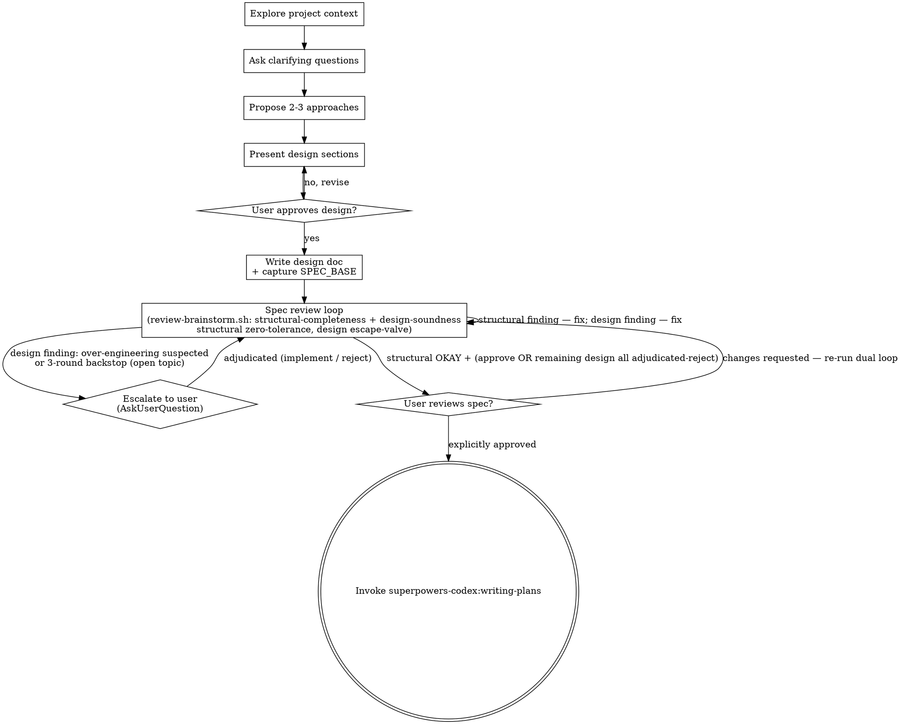

# Anti-Over-Engineering Escape Valve — Implementation Plan

> **For agentic workers:** REQUIRED SUB-SKILL: Use superpowers-codex:subagent-driven-development to implement this plan task-by-task. Steps use checkbox (`- [ ]`) syntax for tracking.

**Goal:** Add an anti-over-engineering escape valve to the `brainstorming` skill's spec review loop and a matching carve-out to `subagent-driven-development`'s final adversarial gate, so a purely adversarial reviewer can no longer drive endless over-engineering.

**Architecture:** Both target files are Markdown instruction files that ARE the plugin's shipped runtime behavior (per this repo's CLAUDE.md, `skills/**/*.md` is product code, not docs). The change edits prose/pseudocode: a per-round ledger, two escalation triggers routing to `AskUserQuestion`, a relaxed exit condition where user-adjudicated-reject topics are non-blocking, a Non-goals/Accepted-limitations recording structure, and a downstream carve-out that lets the final gate honor spec-adjudicated rejections. The inserted instructions are written in **English** to match the existing SKILL.md files (the繁中 spec is the design source; the shipped instructions stay English).

**Tech Stack:** Markdown (skill instruction files). No executable code changes. Existing hermetic bash test suite (`scripts/*.test.sh`) is used only as a regression guard because no wrapper scripts change.

**Verification approach (why no new automated tests):** these files have no runtime surface a unit test could exercise — they are instructions an LLM agent reads. Verification is therefore: (a) exact-string grep presence/absence checks per edit, (b) running the unchanged wrappers' existing test suite as a regression guard, and (c) a final internal-consistency read-through. Building a test harness for prose would itself be the over-engineering this feature exists to prevent.

**Source spec:** `docs/superpowers/specs/2026-07-11-review-loop-overengineering-escape-valve-design.md`

---

## File Structure

- **Modify:** `skills/brainstorming/SKILL.md` — main change. New escape-valve subsection (ledger + triggers + rejection recording) in the "Spec Review Loop" region; the "Round loop" block rewritten; Checklist item 6 and the Process Flow diagram updated for consistency.
- **Modify:** `skills/subagent-driven-development/SKILL.md` — downstream carve-out in the "Final adversarial reviewer" section; the "Zero tolerance" line softened to reference it.
- **Unchanged (regression guard only):** `scripts/review-brainstorm.sh`, `scripts/review-final.sh`, `scripts/review-batch-lib.sh`, all reviewer prompt/focus `.md` files, and `scripts/*.test.sh`.

Task order: Tasks 1–3 edit `brainstorming/SKILL.md` in place (do them in order — they target disjoint regions, so they are independent); Task 4 edits `subagent-driven-development/SKILL.md`; Task 5 is whole-repo regression + internal-consistency verification (report-only — it makes NO edits).

---

### Task 1: brainstorming — add the escape-valve subsection (ledger + triggers + rejection recording)

**Files:**
- Modify: `skills/brainstorming/SKILL.md` (insert after the "Design Soundness reviewer" description, before "Single batched dispatch per round")

- [ ] **Step 1: Insert the escape-valve subsection**

Find this exact text (the Design Soundness reviewer description):

```markdown
**Design Soundness reviewer** (read-only):
Challenges design-level soundness: failure paths / partial failure / rollback, concurrency and ordering assumptions, boundary and empty states, compatibility / migration risk, unstated critical assumptions. Returns `Verdict: approve` or `Verdict: needs-attention`.
```

Replace it with that same text followed by the new subsection:

```markdown
**Design Soundness reviewer** (read-only):
Challenges design-level soundness: failure paths / partial failure / rollback, concurrency and ordering assumptions, boundary and empty states, compatibility / migration risk, unstated critical assumptions. Returns `Verdict: approve` or `Verdict: needs-attention`.

**Escape valve for design-soundness findings (anti-over-engineering):**

The design-soundness reviewer is adversarial by construction, so it will always find "you could be more rigorous." Blindly fixing every finding drives over-engineering: writing atomicity, deploy/rollback machinery, or parsers for near-impossible edge cases that a small tool does not need or that another mechanism already covers. The escape valve hands the "is this concern worth the cost?" judgment back to the user instead of letting the loop escalate rigor without bound. It applies **only to design-soundness findings** — structural-completeness stays zero-tolerance.

**Per-round ledger (required):** Each round, after parsing `=== Summary ===`, maintain a visible ledger table in your reply and update it every round:

| Topic | Consecutive rounds flagged | Status |
|---|---|---|
| semantic summary of the concern | N | `open` / `adjudicated-implement` / `adjudicated-reject` |

- **Topic** is judged *semantically* — a reviewer rewording the same root concern across rounds is the same topic, and its round count accumulates.
- **Consecutive rounds flagged** counts consecutive rounds the topic appears in design-soundness findings; a round in which it is not flagged resets it to zero.
- **Status:** `open` (not yet adjudicated), `adjudicated-implement` (user chose to fix it), `adjudicated-reject` (user chose not to; recorded in the spec's Non-goals / Accepted limitations).

The ledger is an in-session heuristic tracker, re-emitted in full each round from the current round's reviewer output — it is not durable repo state (the `adjudicated-reject` decisions themselves live durably in the spec). **Fail-closed degradation:** if context compaction or agent handoff makes a topic's consecutive count uncertain *and* the topic is still being flagged this round, escalate via `AskUserQuestion` rather than silently resetting the count and continuing to fight — underestimating the count would defeat the backstop. The subjective trigger and the structural-completeness reviewer are unaffected by a lost count.

**Two escalation triggers — both route to `AskUserQuestion`; never self-adjudicate an "accepted limitation."** Whether to accept a concern is the user's call; your job is to detect and escalate, not to decide YAGNI for the user.

- **Subjective (early, discretionary):** if you judge a design-soundness finding may be over-engineering — disproportionate to this project's actual scale, aimed at a near-impossible edge case, or already covered by another mechanism — escalate *immediately* via `AskUserQuestion`. Do not silently fix it and do not silently skip it.
- **Objective (mandatory backstop):** if the ledger shows an `open` topic flagged for **three consecutive rounds**, you **must** escalate via `AskUserQuestion`, even if each round's fix felt reasonable.

At escalation, present the specific finding, why you suspect over-engineering (or that it has been fought three rounds, with the ledger count), and roughly what implementing it would cost. Offer two choices: **Implement** (reviewer is right → fix it; topic becomes `adjudicated-implement`) or **Don't implement** (record it as an explicit accepted limitation with the user's rationale in the spec; topic becomes `adjudicated-reject`). The auto-added "Other" lets the user propose a middle ground; handle per their instruction and record the topic as `adjudicated-implement` or `adjudicated-reject` accordingly.

The backstop applies to `open` topics only; once a topic is adjudicated it leaves `open` and is never re-escalated by the backstop. A concern that newly arises *after* a topic becomes `adjudicated-implement` (including after implementing an "Other" middle ground) is a **new topic** with its own fresh count — it does not inherit the old topic's rounds.

**Recording adjudicated rejections (Non-goals / Accepted limitations):** when the user adjudicates a concern as `adjudicated-reject`, record it in a **Non-goals / Accepted limitations** section of the spec being written, one entry each — **Concern** (the reviewer's concern, summarized), **Decision** (not implemented), **Rationale** (why not: disproportionate to scale / already covered by another mechanism / a near-impossible edge case, as the user stated). This is a durable record: it survives context compaction and is the basis for downstream adversarial acceptance (see `subagent-driven-development`). Reuse an existing equivalent section (e.g. a "Non-goals" heading) if the spec already has one. **Scope / stale-waiver guard:** each rejection is scoped to the design premise under which it was made; if later spec edits materially change that premise (e.g. the cost structure judged "disproportionate," or the other mechanism that covered it), the rejection no longer auto-applies — treat the concern as a fresh issue and route it back through the normal loop.
```

- [ ] **Step 2: Verify the new content is present**

Run: `grep -c "Escape valve for design-soundness findings" skills/brainstorming/SKILL.md`
Expected: `1`

Run: `grep -c "Two escalation triggers\|three consecutive rounds\|Fail-closed degradation\|Recording adjudicated rejections" skills/brainstorming/SKILL.md`
Expected: `4`

- [ ] **Step 3: Verify the original reviewer description is intact (not duplicated/broken)**

Run: `grep -c "Returns \`Verdict: approve\` or \`Verdict: needs-attention\`." skills/brainstorming/SKILL.md`
Expected: `1`

- [ ] **Step 4: Commit**

```bash
git add skills/brainstorming/SKILL.md
git commit -m "feat: add escape-valve ledger and escalation triggers to brainstorming review loop"
```

---

### Task 2: brainstorming — rewrite the "Round loop" block for the escape valve

**Files:**
- Modify: `skills/brainstorming/SKILL.md` (replace the "Round loop — zero tolerance:" heading, pseudocode block, and its trailing paragraph)

- [ ] **Step 1: Replace the round-loop block**

Find this exact block:

````markdown
**Round loop — zero tolerance:**

```
while true:
  summary = run_review_brainstorm(spec_file, SPEC_BASE)   # ONE wrapper call, both reviewers
  parse === Summary ===   # read stdout on ANY exit code (stdout is authoritative)
  structural = structural_completeness verdict   # Status: OKAY | Issues Found | ERROR (tool failed…)
  design     = design_soundness verdict          # Verdict: approve | needs-attention | ERROR (tool failed…) | prose

  if structural is "ERROR (tool failed…)" OR design is "ERROR (tool failed…)":
    continue   # tool failure, NOT a review result — re-run the WHOLE wrapper, same args

  if structural == "Status: OKAY" AND design == "Verdict: approve":
    break   # both passed — exit loop

  # Only real reviewer findings (Issues Found / needs-attention, and any prose finding) reach here.
  fix_all_findings(structural.issues + design.findings)   # every finding — none skipped
  commit_round_fixes()
  # spec was edited — re-run the whole wrapper next round (both reviewers re-run together)
```

Any finding from either reviewer blocks the round. An `ERROR (tool failed…)` is a tool failure,
not a finding: re-run the whole wrapper rather than entering the fix loop. Fix every real finding
before re-running.
````

Replace it with:

````markdown
**Round loop — structural zero-tolerance + design escape valve:**

```
while true:
  summary = run_review_brainstorm(spec_file, SPEC_BASE)   # ONE wrapper call, both reviewers
  parse === Summary ===   # read stdout on ANY exit code (stdout is authoritative)
  structural = structural_completeness verdict   # Status: OKAY | Issues Found | ERROR (tool failed…)
  design     = design_soundness verdict          # Verdict: approve | needs-attention | ERROR (tool failed…) | prose

  if structural is "ERROR (tool failed…)" OR design is "ERROR (tool failed…)":
    continue   # tool failure, NOT a review result — re-run the WHOLE wrapper, same args

  update_ledger(design.findings)   # per-round ledger; semantic topics; fail-closed on uncertain counts
                                   # only AFTER ERROR is ruled out — a failed tool has no real findings

  # Exit condition. structural is always zero-tolerance; design gets the escape valve.
  if structural == "Status: OKAY" AND (
        design == "Verdict: approve"
        OR every remaining design finding maps to an `adjudicated-reject` ledger topic):
    break   # both passed, OR the only remaining design findings are user-rejected topics

  if structural == "Status: Issues Found":
    fix_all_structural_issues()          # structural findings: always fix (zero tolerance)

  for finding in design.findings:        # design findings: escape valve applies
    topic = ledger_topic(finding)
    if topic.status == "adjudicated-reject":
      continue                           # non-blocking — do not re-fix, do not re-escalate
    elif topic.status == "open" AND (subjective_over_engineering(finding) OR topic.consecutive_rounds == 3 OR count_uncertain(topic)):
      adjudicate_with_user(topic)        # AskUserQuestion; then ACT on the choice (see below) before committing
                                         # count_uncertain: fail-closed — after compaction/handoff, an uncertain
                                         # consecutive count on a still-flagged topic escalates instead of continuing
    else:
      fix_finding(finding)               # open (not escalating) OR adjudicated-implement: fix it this round

  commit_round_fixes()
  # spec was edited — re-run the whole wrapper next round (both reviewers re-run together)
```

Structural-completeness stays zero-tolerance: its `Issues Found` are always fixed. The escape valve applies only to design-soundness findings. A topic the user adjudicated `adjudicated-reject` is non-blocking on all later rounds — do not re-fix or re-escalate it; the loop can exit once structural is `Status: OKAY` and every remaining design finding maps to an `adjudicated-reject` topic, **even if design-soundness never returns `approve`**. An `ERROR (tool failed…)` is a tool failure, not a finding: re-run the whole wrapper rather than entering the fix loop.

`adjudicate_with_user(topic)` is not complete until you **act on the user's choice before committing this round**: on **Implement**, set the topic to `adjudicated-implement` and fix the finding this round; on **Don't implement**, set it to `adjudicated-reject` and record the accepted limitation in the spec's Non-goals / Accepted limitations section before committing. Only `adjudicated-reject` becomes non-blocking; an `adjudicated-implement` topic is still fixed each round it is flagged (it falls to `fix_finding`) and is never re-escalated by the backstop — a genuinely new concern arising after it is a new topic with its own count.
````

- [ ] **Step 2: Update the "Caller control-flow" item 5 so it no longer contradicts the escape valve**

The numbered "Caller control-flow (read stdout on ANY exit code)" list in the same "Spec Review Loop" region still describes the old zero-tolerance exit. Find this exact item:

```markdown
5. **Otherwise** apply the round loop: if either reviewer reports a finding, fix ALL findings,
   commit, and re-run the whole wrapper next round; when structural-completeness is
   `Status: OKAY` AND design-soundness is `Verdict: approve` in the same round, the loop ends.
```

Replace it with:

```markdown
5. **Otherwise** apply the round loop: always fix ALL structural-completeness findings; for
   design-soundness findings apply the escape valve (fix, or escalate suspected over-engineering
   or a three-round-repeated `open` topic via `AskUserQuestion`; `adjudicated-reject` topics are
   non-blocking). Commit and re-run the whole wrapper next round. The loop ends when, in the same
   round, structural-completeness is `Status: OKAY` AND (design-soundness is `Verdict: approve`
   OR every remaining design finding maps to an `adjudicated-reject` topic).
```

- [ ] **Step 3: Verify the new block is present and the old framing is gone**

Run: `grep -c "structural zero-tolerance + design escape valve" skills/brainstorming/SKILL.md`
Expected: `1`

Run: `grep -c "even if design-soundness never returns" skills/brainstorming/SKILL.md`
Expected: `1`

Run: `grep -c 'topic.status == "open" AND' skills/brainstorming/SKILL.md`
Expected: `1` (backstop guarded to `open` topics only)

Run: `grep -c "if either reviewer reports a finding, fix ALL findings" skills/brainstorming/SKILL.md`
Expected: `0` (old Caller control-flow item 5 wording removed)

Run: `grep -c "fix_all_findings(structural.issues + design.findings)" skills/brainstorming/SKILL.md`
Expected: `0`

- [ ] **Step 4: Commit**

```bash
git add skills/brainstorming/SKILL.md
git commit -m "feat: rewrite brainstorming round loop with relaxed design-soundness exit"
```

---

### Task 3: brainstorming — update Checklist items 6–7, the Process Flow diagram, and remaining exit wording

**Files:**
- Modify: `skills/brainstorming/SKILL.md` (Checklist items 6 and 7; Process Flow dot graph; Spec Review Loop intro; User Review Gate prose — all brought in line with the relaxed exit)

- [ ] **Step 1: Replace Checklist item 6 (fix the exit-condition grouping so structural `OKAY` is required on BOTH exit paths)**

Find this exact line:

```markdown
6. **Spec review loop (dual reviewer, codex)** — capture `SPEC_BASE` before writing the spec; after committing, dispatch both reviewers each round with ONE `review-brainstorm.sh` call (it runs the structural-completeness and design-soundness reviewers in parallel); read the wrapper's stdout `=== Summary ===` on any exit code; fix ALL findings; loop until the structural-completeness reviewer returns `Status: OKAY` AND the design-soundness reviewer returns `Verdict: approve` in the same round (see below — do NOT do this inline)
```

Replace it with (note the explicit parentheses grouping — structural `OKAY` is mandatory in both exit paths):

```markdown
6. **Spec review loop (dual reviewer, codex)** — capture `SPEC_BASE` before writing the spec; after committing, dispatch both reviewers each round with ONE `review-brainstorm.sh` call (it runs the structural-completeness and design-soundness reviewers in parallel); read the wrapper's stdout `=== Summary ===` on any exit code; maintain the per-round ledger; fix ALL structural-completeness findings; for design-soundness findings apply the escape valve (escalate suspected over-engineering, or any `open` topic flagged three consecutive rounds, via `AskUserQuestion`; `adjudicated-reject` topics are non-blocking); loop until, in the same round, structural-completeness is `Status: OKAY` AND (design-soundness is `Verdict: approve` OR the only remaining design findings map to `adjudicated-reject` topics) (see below — do NOT do this inline)
```

- [ ] **Step 2: Replace the ENTIRE Process Flow dot code block**

Replace the whole fenced ` ```dot … ``` ` block (the entire `digraph brainstorming { … }`, from the opening ` ```dot ` fence to its closing ` ``` `) with this corrected version. This fixes the stale `both parallel, both must pass` node label (which taught the old zero-tolerance rule), adds the escalation node/edges, and makes the exit edge unambiguous. Every reference to the review-loop node uses the SAME new id string so dot keeps it one node:



- [ ] **Step 3: Update the remaining stale exit wording elsewhere in the skill**

Four other spots still describe the old "both must pass / until approve" exit and must be brought in line with the relaxed exit. Make each replacement:

**(a) Checklist item 7.** Find:

```markdown
7. **User reviews written spec** — ask user to review the spec file before proceeding; if changes requested, fix them and re-run the dual review loop (step 6) until both pass, then wait for explicit approval
```

Replace with:

```markdown
7. **User reviews written spec** — ask user to review the spec file before proceeding; if changes requested, fix them and re-run the dual review loop (step 6) until it clears (structural-completeness `Status: OKAY` and design-soundness `Verdict: approve`, or the only remaining design-soundness findings are `adjudicated-reject` topics), then wait for explicit approval
```

**(b) Spec Review Loop intro sentence.** Find:

```markdown
Do NOT perform inline self-review. After writing and committing the spec document, dispatch **two reviewers in parallel** using the codex companion. Both reviewers examine the same spec document; both must pass before proceeding.
```

Replace with:

```markdown
Do NOT perform inline self-review. After writing and committing the spec document, dispatch **two reviewers in parallel** using the codex companion. Both reviewers examine the same spec document. Before proceeding, structural-completeness must reach `Status: OKAY` and design-soundness must reach `Verdict: approve` — or have its only remaining findings be `adjudicated-reject` topics via the escape valve (below).
```

**(c) User Review Gate opening.** Find:

```markdown
After the dual review loop reports both OKAY and approve, ask the user to review the written spec before proceeding:
```

Replace with:

```markdown
After the dual review loop clears (structural-completeness `Status: OKAY` and design-soundness `Verdict: approve`, or the only remaining design-soundness findings are `adjudicated-reject` topics), ask the user to review the written spec before proceeding:
```

**(d) User Review Gate re-run instruction.** Find:

```markdown
3. Re-run the dual spec review loop with ONE `review-brainstorm.sh` call (both the structural-completeness and design-soundness reviewers in parallel, until both pass). The wrapper takes only `--spec`/`--base` and always re-reviews the whole spec — there is no per-section focus — so any edit re-runs both reviewers over the entire spec.
```

Replace with:

```markdown
3. Re-run the dual spec review loop with ONE `review-brainstorm.sh` call (both the structural-completeness and design-soundness reviewers in parallel, until it clears per the escape-valve exit condition in step 6). The wrapper takes only `--spec`/`--base` and always re-reviews the whole spec — there is no per-section focus — so any edit re-runs both reviewers over the entire spec.
```

- [ ] **Step 4: Verify the diagram, checklist, and exit-wording edits**

Run: `grep -c "Escalate to user" skills/brainstorming/SKILL.md`
Expected: `3` (one node declaration + two edges)

Run: `grep -c "both parallel, both must pass" skills/brainstorming/SKILL.md`
Expected: `0` (stale zero-tolerance node label fully removed)

Run: `grep -c "structural zero-tolerance, design escape-valve" skills/brainstorming/SKILL.md`
Expected: `8` (1 node declaration + 7 edge endpoint references — the self-loop line references the node at both endpoints; dot keeps them one node)

Run (single-quoted so the backticks stay literal, not command substitution): `grep -c 'structural-completeness is `Status: OKAY` AND (design-soundness is `Verdict: approve`' skills/brainstorming/SKILL.md`
Expected: `1` (checklist grouping now explicit)

Run: `grep -cF 'until both pass' skills/brainstorming/SKILL.md`
Expected: `0` (both stale "until both pass" phrases replaced)

Run: `grep -cF 'reports both OKAY and approve' skills/brainstorming/SKILL.md`
Expected: `0` (User Review Gate opening updated)

Run: `grep -cF 'both must pass before proceeding' skills/brainstorming/SKILL.md`
Expected: `0` (Spec Review Loop intro updated)

Run: `grep -c "fix ALL findings; loop until the structural-completeness reviewer returns" skills/brainstorming/SKILL.md`
Expected: `0` (old checklist item 6 wording removed)

- [ ] **Step 5: Commit**

```bash
git add skills/brainstorming/SKILL.md
git commit -m "feat: update brainstorming checklist, flow diagram, and exit wording for the escape valve"
```

---

### Task 4: subagent-driven-development — final-gate carve-out for spec-adjudicated rejections

**Files:**
- Modify: `skills/subagent-driven-development/SKILL.md` (in "Final adversarial reviewer": update the `approve`/`needs-attention` control-flow bullets; add the carve-out before "Caller HEAD contract"; soften the "Zero tolerance" line; update the Process Flow diagram edges so they don't still teach fix-until-approve)

- [ ] **Step 1: Update the `approve` / `needs-attention` control-flow bullets**

Find these exact lines:

```markdown
- `Verdict: approve` → passes the final gate; proceed to `superpowers-codex:finishing-a-development-branch`.
- `Verdict: needs-attention` → collect every finding (file, line range, recommendation),
  dispatch the implementer to fix all, then re-run `review-final.sh` with the same `<IMPL_BASE>`;
  repeat until `Verdict: approve`.
```

Replace them with:

```markdown
- `Verdict: approve` → passes the final gate; proceed to `superpowers-codex:finishing-a-development-branch`. The gate also clears when the only remaining `needs-attention` findings are non-blocking spec-adjudicated rejections (see the carve-out below), even if the reviewer never emits `approve`.
- `Verdict: needs-attention` → collect every finding (file, line range, recommendation). Apply the spec-adjudicated-rejection carve-out below: a finding that clearly matches a still-valid accepted limitation is non-blocking and is NOT implemented. Dispatch the implementer to fix all remaining (blocking) findings, then re-run `review-final.sh` with the same `<IMPL_BASE>`; repeat until `Verdict: approve`, or until every remaining `needs-attention` finding is a non-blocking spec-adjudicated rejection.
```

- [ ] **Step 2: Insert the carve-out paragraph before the Caller HEAD contract**

Find this exact text:

```markdown
**Caller HEAD contract:** Do not advance `HEAD` while `review-final.sh` is running — the reviewer
diffs `<IMPL_BASE>..HEAD`. Commit any fixes before re-running the gate, not while it runs.
```

Replace it with:

```markdown
**Respect spec-adjudicated rejections (narrow carve-out):** Before fixing final-adversarial findings, read the **Non-goals / Accepted limitations** section of the spec this plan was derived from. If a finding is *clearly the same concern* as an item the spec records there as an accepted limitation (an `adjudicated-reject` from brainstorming), treat that finding as **non-blocking** — do not implement it, and note in your report which accepted limitation it maps to (quote the recorded concern). This does not ask the user; it honors a decision the user already made.

- **Conservative matching (this bypasses the merge gate — fail safe):** suppress only when the finding is clearly the same concern the user rejected. If the overlap is partial, the scope differs, or the match is ambiguous, **default to blocking** and handle it as a normal finding.
- **Premise check before suppression:** before suppressing, state in your report the premise the accepted limitation rested on (its recorded rationale) and confirm it still holds for the current implementation. If implementation drift changed that premise, or you cannot confirm it holds, the rejection has lapsed — the finding **blocks** as normal.
- All findings not covered by a spec-adjudicated rejection are handled exactly as before.

**Caller HEAD contract:** Do not advance `HEAD` while `review-final.sh` is running — the reviewer
diffs `<IMPL_BASE>..HEAD`. Commit any fixes before re-running the gate, not while it runs.
```

- [ ] **Step 3: Soften the trailing zero-tolerance line to reference the carve-out**

The exact bolded final-gate line below is unique in the file (the earlier per-task "…the loop runs automatically until the gate clears." is a different, non-bolded sentence). Find this exact line:

```markdown
**Zero tolerance; do not ask the user** — the loop runs automatically until the gate clears.
```

Replace it with:

```markdown
**Zero tolerance, except spec-adjudicated rejections above; do not ask the user** — the loop runs automatically until the gate clears.
```

- [ ] **Step 4: Update the Process Flow diagram edges so they no longer teach fix-until-approve**

Find these exact two edge lines in the `digraph` block:

```
    "Verdict: approve?" -> "Implementer fixes adversarial findings, re-commit" [label="no (needs-attention)"];
```

Replace with:

```
    "Verdict: approve?" -> "Implementer fixes adversarial findings, re-commit" [label="no (needs-attention) — fix all except spec-adjudicated rejections"];
```

Then find:

```
    "Verdict: approve?" -> "Use superpowers-codex:finishing-a-development-branch" [label="yes"];
```

Replace with:

```
    "Verdict: approve?" -> "Use superpowers-codex:finishing-a-development-branch" [label="yes (or only spec-adjudicated rejections remain)"];
```

- [ ] **Step 5: Verify the carve-out, control flow, and diagram edits**

Run: `grep -c "Respect spec-adjudicated rejections (narrow carve-out)" skills/subagent-driven-development/SKILL.md`
Expected: `1`

Run: `grep -c "Conservative matching (this bypasses the merge gate\|Premise check before suppression" skills/subagent-driven-development/SKILL.md`
Expected: `2`

Run: `grep -c "Zero tolerance, except spec-adjudicated rejections above; do not ask the user" skills/subagent-driven-development/SKILL.md`
Expected: `1`

Run: `grep -c "or until every remaining \`needs-attention\` finding is a non-blocking spec-adjudicated rejection" skills/subagent-driven-development/SKILL.md`
Expected: `1` (needs-attention control flow updated)

Run: `grep -c "no (needs-attention) — fix all except spec-adjudicated rejections\|yes (or only spec-adjudicated rejections remain)" skills/subagent-driven-development/SKILL.md`
Expected: `2` (both diagram edges updated)

Run: `grep -c "repeat until \`Verdict: approve\`.$" skills/subagent-driven-development/SKILL.md`
Expected: `0` (old fix-until-approve bullet wording removed)

- [ ] **Step 6: Commit**

```bash
git add skills/subagent-driven-development/SKILL.md
git commit -m "feat: honor spec-adjudicated rejections at the final adversarial gate"
```

---

### Task 5: Regression + internal-consistency verification (report-only — makes NO edits)

**Files:**
- Test (regression, unchanged): `scripts/review-batch-lib.test.sh`, `scripts/dispatch.test.sh`, `scripts/preflight.test.sh`
- Review (read-only): `skills/brainstorming/SKILL.md`, `skills/subagent-driven-development/SKILL.md`

This task only verifies; it edits nothing. If any check fails, an earlier task (1–4) was done incorrectly — go back and fix it in that task, then re-run this one. Do not patch inconsistencies here (that is why there is no commit step).

- [ ] **Step 1: Run the existing wrapper test suite (regression guard), preserving a nonzero exit on failure**

Run:
```bash
fail=0
for f in scripts/*.test.sh; do
  echo "== $f =="
  bash "$f" || fail=1
done
exit $fail
```
Expected: every suite prints its `ok - …` lines and the loop exits `0`. A nonzero exit means a suite failed — since no scripts changed, check whether an edit accidentally touched a wrapper (Step 2).

- [ ] **Step 2: Confirm the change set touched ONLY the two SKILL.md files (no wrapper scripts or reviewer prompts)**

Substitute the actual pre-implementation base SHA — the `IMPL_BASE` value subagent-driven-development captured before Task 1's first commit (same substitute-the-SHA pattern as `SPEC_BASE`) — then run:
```bash
IMPL_BASE=<paste-the-captured-IMPL_BASE-sha>
git diff --name-only "$IMPL_BASE"..HEAD
```
Expected: exactly `skills/brainstorming/SKILL.md` and `skills/subagent-driven-development/SKILL.md` (plus this plan file only if it was amended during review). NO path under `scripts/`, and no `*-reviewer-prompt.md`, `*-focus.md`, or `spec-document-reviewer-prompt.md`, may appear. If a wrapper/prompt path appears, an earlier task edited a file it must not — revert that edit in that task.

- [ ] **Step 3: Confirm no stale contradictory wording remains in brainstorming/SKILL.md**

Run: `grep -n "zero tolerance\|zero-tolerance\|Zero tolerance" skills/brainstorming/SKILL.md`
Expected: the only surviving mentions are structural-completeness-scoped (the "structural zero-tolerance + design escape valve" heading and the sentence stating structural findings are always fixed). NO surviving line may claim ALL design-soundness findings must be fixed to reach `approve`. If one does, Task 2 was done incorrectly — fix it in Task 2 and re-run.

- [ ] **Step 4: Internal-consistency read-through**

Read the full "Spec Review Loop" region of `skills/brainstorming/SKILL.md` and the "Final adversarial reviewer" section (including its Process Flow diagram) of `skills/subagent-driven-development/SKILL.md`. Confirm, as a checklist:
- Status names are consistent everywhere: only `open`, `adjudicated-implement`, `adjudicated-reject` appear.
- The ledger, the two triggers, the relaxed exit condition, and the Non-goals recording structure are mutually consistent.
- The Process Flow diagram edges match the prose (escalation node present; exit edge mentions the adjudicated-reject path; no "both must pass" label survives).
- The subagent-driven-development carve-out references the same "Non-goals / Accepted limitations" section name that brainstorming writes.

Run: `grep -cE 'implemented-verified|`implementing`' skills/brainstorming/SKILL.md` (single-quoted so the backticks stay literal; `-E` for portable alternation)
Expected: `0` (these states were never in scope)

Run: `grep -c "both parallel, both must pass" skills/brainstorming/SKILL.md`
Expected: `0`

- [ ] **Step 5: Report the verification outcome (no commit)**

This task makes no edits, so there is nothing to commit. Report PASS only when Steps 1–4 all pass. If any step failed, name the earlier task that must be fixed and stop.

**Spec §8 acceptance note:** §8's "走一次 spec 審查迴圈（本 spec 自身即經此迴圈）… 確認新流程可被 agent 正確依循" was satisfied during brainstorming — the design spec passed the dual review loop and the escape-valve flow was exercised live before this plan existed. It is therefore not re-run here; this task covers §8's remaining acceptance items (unchanged wrappers pass; no wrapper edits; internal consistency).

---

## Done criteria

- `skills/brainstorming/SKILL.md`: escape-valve subsection, rewritten round loop, updated checklist item 6, and updated flow diagram are all present and mutually consistent.
- `skills/subagent-driven-development/SKILL.md`: final-gate carve-out present with conservative matching + premise check; the `approve`/`needs-attention` control-flow bullets and diagram edges reflect it; zero-tolerance line references it.
- All `scripts/*.test.sh` suites pass (regression guard; no scripts changed).
- The change set touches ONLY `skills/brainstorming/SKILL.md` and `skills/subagent-driven-development/SKILL.md` (no wrapper scripts, no reviewer prompt/focus files).
- Spec §8 acceptance is met: unchanged wrappers pass, no wrapper edits, internal consistency holds; §8's "run the spec review loop" item was satisfied live during brainstorming.
- No surviving wording contradicts the escape valve.
