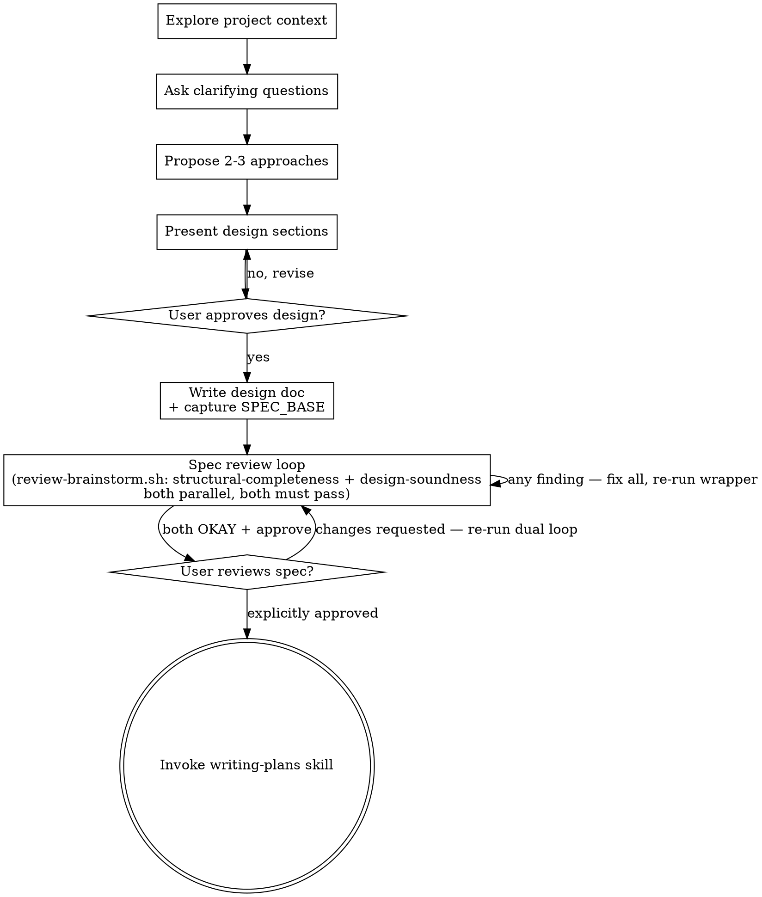

# Brainstorming Ideas Into Designs

Help turn ideas into fully formed designs and specs through natural collaborative dialogue.

Start by understanding the current project context, then ask questions one at a time to refine the idea. Once you understand what you're building, present the design and get user approval.

<HARD-GATE>
Do NOT invoke any implementation skill, write any code, scaffold any project, or take any implementation action until you have presented a design and the user has approved it. This applies to EVERY project regardless of perceived simplicity.
</HARD-GATE>

## Anti-Pattern: "This Is Too Simple To Need A Design"

Every project goes through this process. A todo list, a single-function utility, a config change — all of them. "Simple" projects are where unexamined assumptions cause the most wasted work. The design can be short (a few sentences for truly simple projects), but you MUST present it and get approval.

## Checklist

You MUST create a task for each of these items and complete them in order:

1. **Explore project context** — check files, docs, recent commits
2. **Ask clarifying questions** — one at a time, understand purpose/constraints/success criteria
3. **Propose 2-3 approaches** — with trade-offs and your recommendation
4. **Present design** — in sections scaled to their complexity, get user approval after each section
5. **Write design doc** — save to `docs/superpowers/specs/YYYY-MM-DD-<topic>-design.md` and commit
6. **Spec review loop (dual reviewer, codex)** — capture `SPEC_BASE` before writing the spec; after committing, dispatch both reviewers each round with ONE `review-brainstorm.sh` call (it runs the structural-completeness and design-soundness reviewers in parallel); read the wrapper's stdout `=== Summary ===` on any exit code; fix ALL findings; loop until the structural-completeness reviewer returns `Status: OKAY` AND the design-soundness reviewer returns `Verdict: approve` in the same round (see below — do NOT do this inline)
7. **User reviews written spec** — ask user to review the spec file before proceeding; if changes requested, fix them and re-run the dual review loop (step 6) until both pass, then wait for explicit approval
8. **Transition to implementation** — invoke writing-plans skill to create implementation plan (this is the ONLY next step; never jump straight to code)

## Process Flow



**The terminal state is invoking writing-plans.** Do NOT invoke frontend-design, mcp-builder, or any other implementation skill. The ONLY skill you invoke after brainstorming is writing-plans.

## The Process

**Understanding the idea:**

- Check out the current project state first (files, docs, recent commits)
- Before asking detailed questions, assess scope: if the request describes multiple independent subsystems (e.g., "build a platform with chat, file storage, billing, and analytics"), flag this immediately. Don't spend questions refining details of a project that needs to be decomposed first.
- If the project is too large for a single spec, help the user decompose into sub-projects: what are the independent pieces, how do they relate, what order should they be built? Then brainstorm the first sub-project through the normal design flow. Each sub-project gets its own spec → plan → implementation cycle.
- For appropriately-scoped projects, ask questions one at a time to refine the idea
- Prefer multiple choice questions when possible, but open-ended is fine too
- Only one question per message - if a topic needs more exploration, break it into multiple questions
- Focus on understanding: purpose, constraints, success criteria

**Exploring approaches:**

- Propose 2-3 different approaches with trade-offs
- Present options conversationally with your recommendation and reasoning
- Lead with your recommended option and explain why

**Presenting the design:**

- Once you believe you understand what you're building, present the design
- Scale each section to its complexity: a few sentences if straightforward, up to 200-300 words if nuanced
- Ask after each section whether it looks right so far
- Cover: architecture, components, data flow, error handling, testing
- Be ready to go back and clarify if something doesn't make sense

**Design for isolation and clarity:**

- Break the system into smaller units that each have one clear purpose, communicate through well-defined interfaces, and can be understood and tested independently
- For each unit, you should be able to answer: what does it do, how do you use it, and what does it depend on?
- Can someone understand what a unit does without reading its internals? Can you change the internals without breaking consumers? If not, the boundaries need work.
- Smaller, well-bounded units are also easier for you to work with - you reason better about code you can hold in context at once, and your edits are more reliable when files are focused. When a file grows large, that's often a signal that it's doing too much.

**Working in existing codebases:**

- Explore the current structure before proposing changes. Follow existing patterns.
- Where existing code has problems that affect the work (e.g., a file that's grown too large, unclear boundaries, tangled responsibilities), include targeted improvements as part of the design - the way a good developer improves code they're working in.
- Don't propose unrelated refactoring. Stay focused on what serves the current goal.

## After the Design

**Documentation:**

- Write the validated design (spec) to `docs/superpowers/specs/YYYY-MM-DD-<topic>-design.md`
  - (User preferences for spec location override this default)
- Use elements-of-style:writing-clearly-and-concisely skill if available
- Commit the design document to git

**Spec Review Loop (Dual Reviewer, codex companion):**

Do NOT perform inline self-review. After writing and committing the spec document, dispatch **two reviewers in parallel** using the codex companion. Both reviewers examine the same spec document; both must pass before proceeding.

**Before writing the spec file**, capture `SPEC_BASE`:

```bash
SPEC_BASE="$(git rev-parse HEAD)"
```

Store this value — it is the parent commit of the spec commit and must not change across rounds.

**Structural Completeness reviewer** (`dispatch.sh task`, read-only):
Checks: placeholder scan, internal consistency, scope check, ambiguity check, YAGNI. Returns `Status: OKAY` or `Status: Issues Found`.

**Design Soundness reviewer** (`dispatch.sh adversarial`):
Challenges design-level soundness: failure paths / partial failure / rollback, concurrency and ordering assumptions, boundary and empty states, compatibility / migration risk, unstated critical assumptions. Returns `Verdict: approve` or `Verdict: needs-attention`.

**Single batched dispatch per round:**

Each round, launch BOTH reviewers with ONE call to the batch wrapper. `${CLAUDE_PLUGIN_ROOT}`
is inline-expanded inside this SKILL.md at load time; the spec path is repo-root-relative.
Fill `<SPEC_BASE>` with the SHA captured before the spec commit; substitute the value, do not
run verbatim:

```bash
"${CLAUDE_PLUGIN_ROOT}/scripts/review-brainstorm.sh" \
  --spec docs/superpowers/specs/<YYYY-MM-DD-topic>-design.md \
  --base <SPEC_BASE>
```

This runs the structural-completeness reviewer (`dispatch.sh task`, spec-document-reviewer
sidecar) and the design-soundness reviewer (`dispatch.sh adversarial`,
`adversarial-spec-review-focus.md`) in parallel and returns ALL output on stdout.

**Caller control-flow (read stdout on ANY exit code):**

1. **Regardless of the wrapper's exit code, read and parse its entire stdout** and locate the
   `=== Summary ===` section — this is the machine-readable status, and stdout is preserved
   in full even on a nonzero exit.
2. Classify each reviewer from its Summary line: `Status: OKAY` / `Status: Issues Found`
   (structural-completeness) and `Verdict: approve` / `Verdict: needs-attention`
   (design-soundness); `ERROR (tool failed, ...)` for a tool failure; or `(prose — 見全文)`
   for a no-verdict reviewer — for a prose line, read that reviewer's full `## <label>`
   section and treat any blocking finding there the same as `Issues Found`.
3. **If any reviewer is ERROR** → **re-run the entire `review-brainstorm.sh` call** (same
   arguments). Do not treat ERROR as a review failure and do not discard stdout.
4. **Otherwise** apply the round loop: if either reviewer reports a finding, fix ALL findings,
   commit, and re-run the whole wrapper next round; when structural-completeness is
   `Status: OKAY` AND design-soundness is `Verdict: approve` in the same round, the loop ends.

**Caller HEAD contract:** Do not advance `HEAD` (commit/rebase/checkout) while
`review-brainstorm.sh` is running — both reviewers must see the same `HEAD` and the same
`<SPEC_BASE>..HEAD` diff. The engine does not detect `HEAD` movement, so the caller must
guarantee it. Commit each round's spec fixes BEFORE launching the next round's wrapper call,
not while it runs.

**Round loop — zero tolerance:**

```
while true:
  summary = run_review_brainstorm(spec_file, SPEC_BASE)   # ONE wrapper call, both reviewers
  parse === Summary ===   # read stdout on ANY exit code (stdout is authoritative)
  structural = structural_completeness verdict   # Status: OKAY | Issues Found | ERROR (tool failed…)
  design     = design_soundness verdict          # Verdict: approve | needs-attention | ERROR (tool failed…) | prose

  if structural is "ERROR (tool failed…)" OR design is "ERROR (tool failed…)":
    continue   # tool failure, NOT a review result — re-run the WHOLE wrapper, same args

  if structural == "Status: OKAY" AND design == "Verdict: approve":
    break   # both passed — exit loop

  # Only real reviewer findings (Issues Found / needs-attention, and any prose finding) reach here.
  fix_all_findings(structural.issues + design.findings)   # every finding — none skipped
  commit_round_fixes()
  # spec was edited — re-run the whole wrapper next round (both reviewers re-run together)
```

Any finding from either reviewer blocks the round. An `ERROR (tool failed…)` is a tool failure,
not a finding: re-run the whole wrapper rather than entering the fix loop. Fix every real finding
before re-running.

**Git commit discipline:** Before the first review round, commit the first version of the spec. After each round's fixes, commit again with a message noting the round (e.g. `docs(spec): fix review round 2 - resolve ambiguity in auth flow`). NEVER use `git add -f` to force-add an ignored file. `review-brainstorm.sh` is a fixed two-reviewer wrapper with no per-reviewer skip option; the design-soundness reviewer diffs `<SPEC_BASE>..HEAD`, so the spec **must be committed** for the wrapper-based review to run as designed. If the spec file is gitignored, the wrapper cannot review it — do not attempt the dual review on a gitignored spec; ask the user to un-ignore (or relocate) the spec so it can be committed before review.

**User Review Gate:**

After the dual review loop reports both OKAY and approve, ask the user to review the written spec before proceeding:

> "Spec written and committed to `<path>`. Please review it and let me know if you want to make any changes before we start writing out the implementation plan."

Wait for the user's response. If they request changes:

1. Make the requested changes.
2. Commit the changes (with a round-labeled commit message) **before** re-running review — `review-brainstorm.sh`'s design-soundness reviewer diffs `<SPEC_BASE>..HEAD`, so uncommitted edits would not be reviewed.
3. Re-run the dual spec review loop with ONE `review-brainstorm.sh` call (both the structural-completeness and design-soundness reviewers in parallel, until both pass). The wrapper takes only `--spec`/`--base` and always re-reviews the whole spec — there is no per-section focus — so any edit re-runs both reviewers over the entire spec.
4. Report the changes back to the user and wait for their next reply.

Only leave this gate and proceed to writing-plans once the user **explicitly approves** (e.g. "OK", "looks good", "start the plan"). Do not proceed on ambiguous or silent responses.

**Implementation:**

The mandatory workflow sequence is **brainstorming → spec document → writing-plans → plan document → implementation**, in strict order. Never jump from brainstorming straight to code, and never skip the spec or plan stages — even for "simple" tasks.

- Invoke the writing-plans skill to create a detailed implementation plan.
- Do NOT invoke any other skill. writing-plans is the ONLY next step after brainstorming.

## Key Principles

- **One question at a time** - Don't overwhelm with multiple questions
- **Multiple choice preferred** - Easier to answer than open-ended when possible
- **YAGNI ruthlessly** - Remove unnecessary features from all designs
- **Explore alternatives** - Always propose 2-3 approaches before settling
- **Incremental validation** - Present design, get approval before moving on
- **Be flexible** - Go back and clarify when something doesn't make sense
