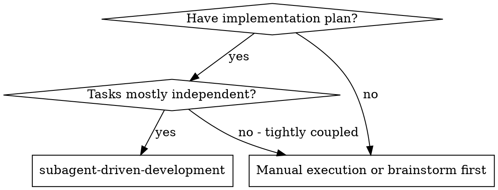
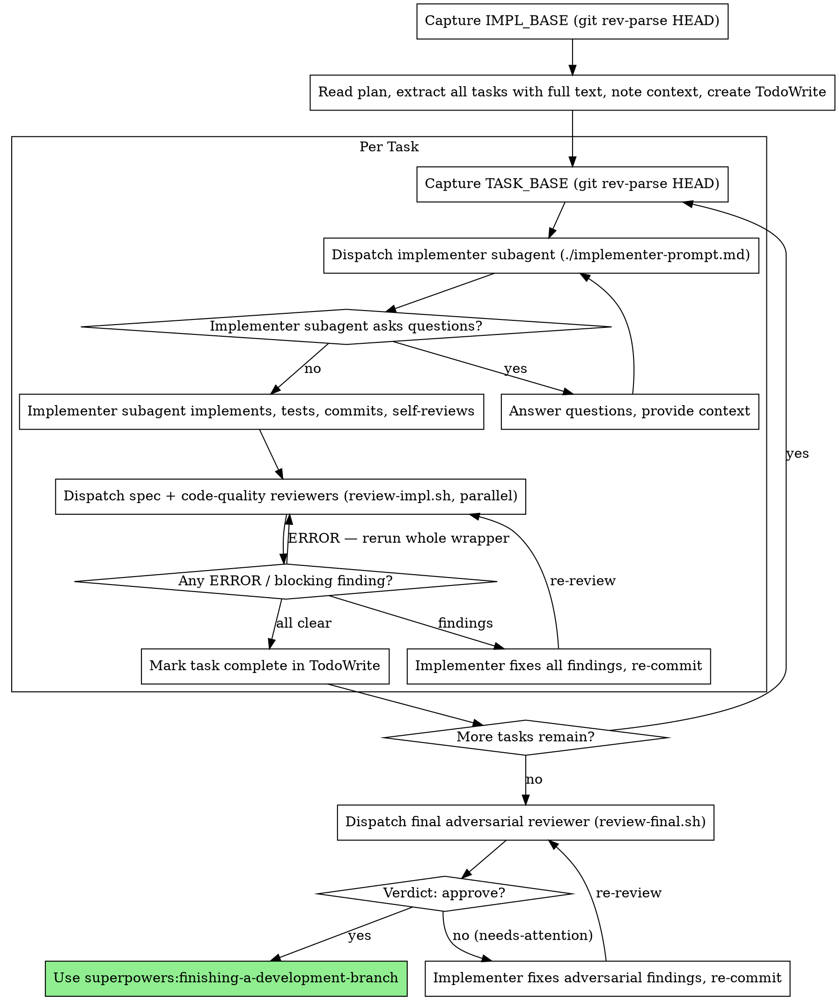

# Subagent-Driven Development

Execute plan by dispatching fresh subagent per task, with a single batched review after each: the spec-compliance and code-quality reviewers run in parallel via one `review-impl.sh` call. After all tasks pass, a single `review-final.sh` call gates the merge.

**Why subagents:** You delegate tasks to specialized agents with isolated context. By precisely crafting their instructions and context, you ensure they stay focused and succeed at their task. They should never inherit your session's context or history — you construct exactly what they need. This also preserves your own context for coordination work.

**Core principle:** Fresh subagent per task + one batched review (spec + quality in parallel) + one final adversarial gate = high quality, fast iteration

**Continuous execution:** Do not pause to check in with your human partner between tasks. Execute all tasks from the plan without stopping. The only reasons to stop are: BLOCKED status you cannot resolve, ambiguity that genuinely prevents progress, or all tasks complete. "Should I continue?" prompts and progress summaries waste their time — they asked you to execute the plan, so execute it.

## When to Use



## The Process



## Base SHA Tracking

You must capture two SHAs at specific moments and keep them in your task-tracking state:

- **`IMPL_BASE`** — run `git rev-parse HEAD` once, before any implementer starts. This is the `--base` passed to the final `review-final.sh` gate.
- **`TASK_BASE`** — run `git rev-parse HEAD` immediately before dispatching each task's implementer. Reset for each task. This is the `--task-base` passed to `review-impl.sh`: the base for the spec-compliance reviewer's `git diff <TASK_BASE>..HEAD` (which Codex runs itself) and for the code-quality reviewer's diff. **Do not advance `HEAD` (commit/rebase/checkout) while `review-impl.sh` is running** — both reviewers must see the same HEAD (the engine does not detect HEAD movement; this is a documented caller contract).

Both SHAs must be direct ancestors of HEAD at the time their respective reviewer runs, so capture them at the right moment — not after the fact.

## Reviewer Dispatch

Every reviewer is launched through a `review-*.sh` wrapper, **run from the repository root**.
Run the wrapper calls as written — do NOT pre-probe them with `--help`, `ls`/`find`, or source
greps before dispatching. `${CLAUDE_PLUGIN_ROOT}` is inline-expanded at load time.

### Per-task batched review (spec-compliance + code-quality)

The per-task spec-compliance and code-quality reviewers run in parallel through ONE
`review-impl.sh` call. Fill `<TASK_BASE>` with the SHA captured before this task's implementer
started, the plan path with the real plan, and `"Task N"` with the actual Task heading.
Substitute the values; do not run verbatim:

```bash
"${CLAUDE_PLUGIN_ROOT}/scripts/review-impl.sh" \
  --plan docs/superpowers/plans/<YYYY-MM-DD-topic>-plan.md \
  --task "Task N" \
  --task-base <TASK_BASE>
```

This launches both reviewers in parallel and returns ALL output on stdout: `spec-compliance`
(final line `Status: OKAY | Issues Found`) and `code-quality` (free-form prose — no `Verdict:`
line). Spec-compliance verifies directly from the task's diff (`git diff <TASK_BASE>..HEAD`);
nothing extra is created, passed, or cleaned up between implementer and reviewer.

**Caller control-flow (read stdout on ANY exit code):**

1. **Regardless of the wrapper's exit code, read and parse its entire stdout** and locate the
   `=== Summary ===` section — stdout is preserved in full even on a nonzero exit.
2. Classify each reviewer from its Summary line: spec-compliance as
   `Status: OKAY` / `Status: Issues Found`; code-quality as `(prose — 見全文)` — read its full
   `## code-quality` section and treat any blocking-severity defect as a finding; or
   `ERROR (tool failed, ...)`.
3. **If either reviewer is ERROR** → **re-run the entire `review-impl.sh` call** (same
   `--plan`/`--task`/`--task-base`). Do not treat ERROR as a review failure and do not discard
   stdout.
4. **If a reviewer's Summary line carries a `(tool exit N)` annotation** (a `Status:`/`Verdict:`
   was produced but the tool then exited nonzero), the result exists but its output may be
   incomplete: read that reviewer's full `## <label>` section and use judgment — re-run the whole
   `review-impl.sh` call if the output looks truncated, otherwise act on the result shown. Neither
   an automatic pass nor a forced rerun.
5. **Otherwise**, if either reviewer has a blocking finding, the implementer fixes ALL findings
   from both reviewers in one pass, re-commits, and you re-run the whole `review-impl.sh` call
   (both reviewers re-run against the same `<TASK_BASE>` and the new HEAD). The Task passes only
   when, in a single batch with no further edits, spec-compliance is `Status: OKAY` and
   code-quality has no blocking finding.

**Code-quality severity calibration:** "blocking" = what a senior engineer would require fixed
before merge — bugs, data-loss risks, broken error handling, security issues, missing critical
test coverage. Style preferences do not trigger a re-review loop. **Do not ask the user** — the
loop runs automatically until the gate clears.

### Final adversarial reviewer

After all tasks pass, the final adversarial merge gate runs through ONE `review-final.sh` call.
Fill `<IMPL_BASE>` with the SHA captured before the first implementer started; substitute the
value, do not run verbatim:

```bash
"${CLAUDE_PLUGIN_ROOT}/scripts/review-final.sh" --base <IMPL_BASE>
```

Read the wrapper's stdout `=== Summary ===` on any exit code. The final-adversarial reviewer
emits a structured `Verdict:` line:

- `Verdict: approve` → passes the final gate; proceed to `superpowers:finishing-a-development-branch`.
- `Verdict: needs-attention` → collect every finding (file, line range, recommendation),
  dispatch the implementer to fix all, then re-run `review-final.sh` with the same `<IMPL_BASE>`;
  repeat until `Verdict: approve`.
- `ERROR (tool failed, ...)` → a tool failure, not a review result; re-run the whole
  `review-final.sh` call (same `--base`).
- `Verdict: ... (tool exit N)` → the verdict was produced but the tool then exited nonzero, so the
  output may be incomplete; read the full `## final-adversarial` section and use judgment — re-run
  `review-final.sh` if it looks truncated, otherwise act on the verdict shown.

**Caller HEAD contract:** Do not advance `HEAD` while `review-final.sh` is running — the reviewer
diffs `<IMPL_BASE>..HEAD`. Commit any fixes before re-running the gate, not while it runs.

**Zero tolerance; do not ask the user** — the loop runs automatically until the gate clears.

## Model Selection

Use the least powerful model that can handle each role to conserve cost and increase speed.

**Mechanical implementation tasks** (isolated functions, clear specs, 1-2 files): use a fast, cheap model. Most implementation tasks are mechanical when the plan is well-specified.

**Integration and judgment tasks** (multi-file coordination, pattern matching, debugging): use a standard model.

**Architecture, design, and review tasks**: use the most capable available model.

**Task complexity signals:**

- Touches 1-2 files with a complete spec → cheap model
- Touches multiple files with integration concerns → standard model
- Requires design judgment or broad codebase understanding → most capable model

## Handling Implementer Status

Implementer subagents report one of four statuses. Handle each appropriately:

**DONE:** Proceed to spec compliance review.

**DONE_WITH_CONCERNS:** The implementer completed the work but flagged doubts. Read the concerns before proceeding. If the concerns are about correctness or scope, address them before review. If they're observations (e.g., "this file is getting large"), note them and proceed to review.

**NEEDS_CONTEXT:** The implementer needs information that wasn't provided. Provide the missing context and re-dispatch.

**BLOCKED:** The implementer cannot complete the task. Assess the blocker:
1. If it's a context problem, provide more context and re-dispatch with the same model
2. If the task requires more reasoning, re-dispatch with a more capable model
3. If the task is too large, break it into smaller pieces
4. If the plan itself is wrong, escalate to the human

**Never** ignore an escalation or force the same model to retry without changes. If the implementer said it's stuck, something needs to change.

## Sidecar files

- `./implementer-prompt.md` — implementer subagent prompt (you fill and dispatch it directly, unchanged)

## Example Workflow

```
You: I'm using Subagent-Driven Development to execute this plan.

[Capture IMPL_BASE: git rev-parse HEAD -> abc1234]
[Read plan file once: docs/superpowers/plans/feature-plan.md]
[Extract all 5 tasks with full text and context]
[Create TodoWrite with all tasks]

Task 1: Hook installation script

[Capture TASK_BASE: git rev-parse HEAD -> abc1234 (same as IMPL_BASE before any work)]
[Dispatch implementation subagent with full task text + context]

Implementer: "Before I begin - should the hook be installed at user or system level?"

You: "User level (~/.config/superpowers/hooks/)"

Implementer: "Got it. Implementing now..."
[Later] Implementer:
  - Implemented install-hook command
  - Added tests, 5/5 passing
  - Self-review: Found I missed --force flag, added it
  - Committed

[Dispatch batched review: review-impl.sh --task "Task 1" --task-base abc1234]
## spec-compliance
Status: OKAY

## code-quality
Clean implementation. No blocking issues found.

=== Summary ===
- spec-compliance: Status: OKAY
- code-quality: (prose — 見全文)
[spec OKAY + no blocking findings -> task passes]

[Mark Task 1 complete]

Task 2: Recovery modes

[Capture TASK_BASE: git rev-parse HEAD -> def5678]
[Dispatch implementation subagent with full task text + context]

Implementer: [No questions, proceeds]
Implementer:
  - Added verify/repair modes
  - 8/8 tests passing
  - Self-review: All good
  - Committed

[Dispatch batched review: review-impl.sh --task "Task 2" --task-base def5678]
## spec-compliance
Status: Issues Found
  - src/recovery.ts:47 — Missing progress reporting (spec says "report every 100 items")
    Fix: [concrete patch provided]
  - src/recovery.ts:112 — Extra --json flag not in spec
    Fix: [concrete removal patch provided]

## code-quality
src/recovery.ts:47 uses magic number 100 — should be a named constant.

=== Summary ===
- spec-compliance: Status: Issues Found
- code-quality: (prose — 見全文)

[Implementer applies ALL findings from both reviewers in one pass, re-commits]

[Re-run batched review: review-impl.sh --task "Task 2" --task-base def5678]
## spec-compliance
Status: OKAY

## code-quality
Clean. No issues.

=== Summary ===
- spec-compliance: Status: OKAY
- code-quality: (prose — 見全文)
[spec OKAY + no blocking findings -> task passes]

[Mark Task 2 complete]

...

[After all tasks complete]
[Dispatch final adversarial reviewer: review-final.sh --base abc1234]
Final reviewer: Verdict: approve

Done — proceed to superpowers:finishing-a-development-branch
```

## Advantages

**vs. Manual execution:**
- Subagents follow TDD naturally
- Fresh context per task (no confusion)
- Parallel-safe (subagents don't interfere)
- Subagent can ask questions (before AND during work)

**Efficiency gains:**
- No file reading overhead (controller provides full text)
- Controller curates exactly what context is needed
- Subagent gets complete information upfront
- Questions surfaced before work begins (not after)

**Quality gates:**
- Self-review catches issues before handoff
- One batched review per task: spec compliance and code quality run in parallel via `review-impl.sh`
- Final adversarial gate (`review-final.sh`) catches cross-task integration problems
- Review loops ensure fixes actually work
- Spec compliance prevents over/under-building
- Code quality ensures implementation is well-built

**Cost:**
- More subagent invocations (implementer + 2 reviewers per task + 1 final)
- Controller does more prep work (capturing SHAs, extracting all tasks upfront)
- Review loops add iterations
- But catches issues early (cheaper than debugging later)

## Red Flags

**Never:**
- Start implementation on main/master branch without explicit user consent
- Skip reviews (spec compliance OR code quality)
- Proceed with unfixed issues
- Dispatch multiple implementation subagents in parallel (conflicts)
- Make subagent read plan file (provide full text instead)
- Skip scene-setting context (subagent needs to understand where task fits)
- Ignore subagent questions (answer before letting them proceed)
- Accept "close enough" on spec compliance (spec reviewer found issues = not done)
- Skip review loops (reviewer found issues = implementer fixes = review again)
- Let implementer self-review replace actual review (both are needed)
- Advance HEAD (commit/rebase/checkout) while `review-impl.sh` is running (both reviewers must see the same HEAD)
- Move to next task while either review has open issues
- **Forget to capture `TASK_BASE` before dispatching each task's implementer** (base SHA will be wrong)
- **Forget to capture `IMPL_BASE` before the first implementer starts** (final reviewer diff will be wrong)
- **Parse a `Verdict:` line from the code-quality reviewer (native review)** — it does not emit one; interpret the prose instead
- Fall back to inline self-review if the `review-*.sh` wrappers are not found — the superpowers-codex plugin is not installed; stop and prompt the user to install it

**If subagent asks questions:**
- Answer clearly and completely
- Provide additional context if needed
- Don't rush them into implementation

**If reviewer finds issues:**
- Implementer (same subagent) fixes them
- Reviewer reviews again
- Repeat until approved
- Don't skip the re-review

**If subagent fails task:**
- Dispatch fix subagent with specific instructions
- Don't try to fix manually (context pollution)

## Integration

**Required workflow skills:**
- **superpowers:writing-plans** - Creates the plan this skill executes
- **superpowers:finishing-a-development-branch** - Complete development after all tasks
