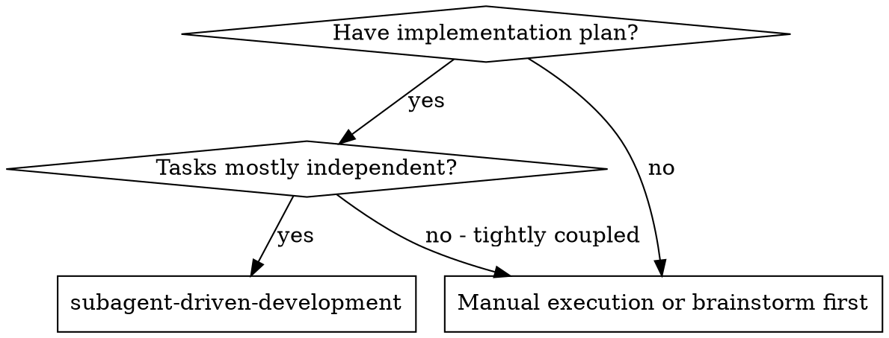
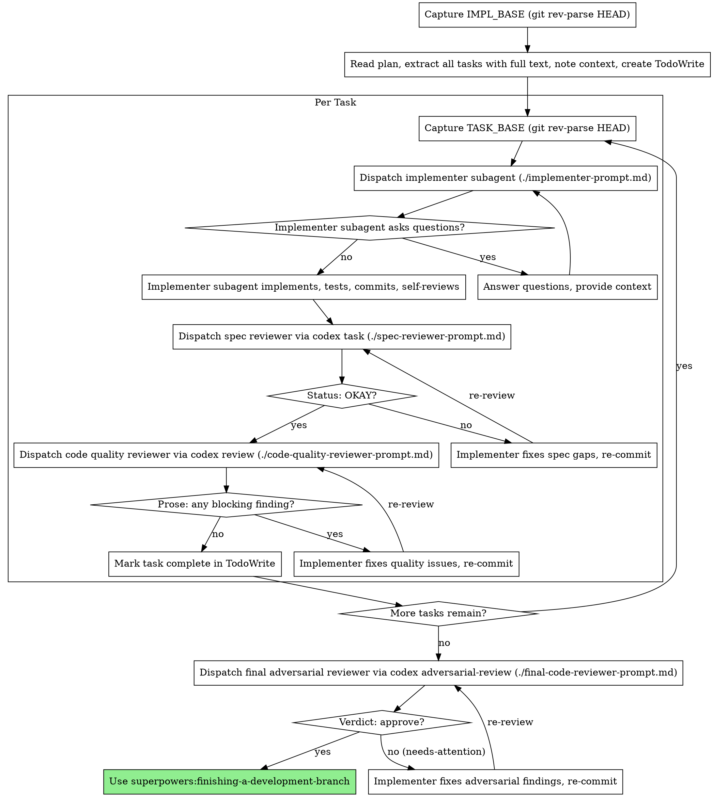

# Subagent-Driven Development

Execute plan by dispatching fresh subagent per task, with two-stage review after each: spec compliance review first (reviewer 5, via codex `task`), then code quality review (reviewer 6, via codex native `review`). After all tasks pass, a single final adversarial review (reviewer 7, via codex `adversarial-review`) gates the merge.

**Why subagents:** You delegate tasks to specialized agents with isolated context. By precisely crafting their instructions and context, you ensure they stay focused and succeed at their task. They should never inherit your session's context or history — you construct exactly what they need. This also preserves your own context for coordination work.

**Core principle:** Fresh subagent per task + two-stage review (spec then quality) + one final adversarial gate = high quality, fast iteration

**Continuous execution:** Do not pause to check in with your human partner between tasks. Execute all tasks from the plan without stopping. The only reasons to stop are: BLOCKED status you cannot resolve, ambiguity that genuinely prevents progress, or all tasks complete. "Should I continue?" prompts and progress summaries waste their time — they asked you to execute the plan, so execute it.

## When to Use



## The Process



## Base SHA Tracking

You must capture two SHAs at specific moments and keep them in your task-tracking state:

- **`IMPL_BASE`** — run `git rev-parse HEAD` once, before any implementer starts. This is the merge point for reviewer 7's `adversarial-review --base`.
- **`TASK_BASE`** — run `git rev-parse HEAD` immediately before dispatching each task's implementer. Reset for each task. This is the base for reviewer 5's `git diff <TASK_BASE>..HEAD` (which Codex runs itself) and for reviewer 6's `review --base <TASK_BASE>`.

Both SHAs must be direct ancestors of HEAD at the time their respective reviewer runs, so capture them at the right moment — not after the fact.

## Reviewer Dispatch Mechanisms

All three reviewers run via the codex companion (`codex-companion.mjs`). See the prompt templates for full dispatch commands including the companion path-resolution block. Those invocation blocks are canonical and self-contained: each resolves the companion path (with a marketplace fallback) and fails loudly if it is absent. Run them as written — do NOT pre-probe the companion with `--help`, `ls`/`find`, or source greps before dispatching. In particular, `task --prompt-file <path>` is supported even though `--help` does not list it (verified in the companion source); treat it as established, not a guess.

| Reviewer | File | Mechanism | Verdict source |
|---|---|---|---|
| 5 — Spec Compliance | `./spec-reviewer-prompt.md` | `codex task` (read-only, custom prompt) | Final `Status: OKAY` or `Status: Issues Found` line in Codex output |
| 6 — Code Quality | `./code-quality-reviewer-prompt.md` | `codex review --base <TASK_BASE>` (native, no custom prompt) | Free-form prose — you interpret: blocking finding -> Issues Found; no blocking -> OKAY |
| 7 — Final Adversarial | `./final-code-reviewer-prompt.md` | `codex adversarial-review --base <IMPL_BASE>` + focus text | Structured `Verdict:` line: `approve` -> pass; `needs-attention` -> fix and re-run |

**Reviewer 6 note:** The native `review` command does NOT emit a `Verdict:` line or `approve`/`needs-attention` output. Do not attempt to parse one. You read the prose and decide whether any blocking-severity finding exists.

## Model Selection

Use the least powerful model that can handle each role to conserve cost and increase speed.

**Mechanical implementation tasks** (isolated functions, clear specs, 1-2 files): use a fast, cheap model. Most implementation tasks are mechanical when the plan is well-specified.

**Integration and judgment tasks** (multi-file coordination, pattern matching, debugging): use a standard model.

**Architecture, design, and review tasks**: use the most capable available model.

**Task complexity signals:**

- Touches 1-2 files with a complete spec → cheap model
- Touches multiple files with integration concerns → standard model
- Requires design judgment or broad codebase understanding → most capable model

## Handling Implementer Status

Implementer subagents report one of four statuses. Handle each appropriately:

**DONE:** Proceed to spec compliance review.

**DONE_WITH_CONCERNS:** The implementer completed the work but flagged doubts. Read the concerns before proceeding. If the concerns are about correctness or scope, address them before review. If they're observations (e.g., "this file is getting large"), note them and proceed to review.

**NEEDS_CONTEXT:** The implementer needs information that wasn't provided. Provide the missing context and re-dispatch.

**BLOCKED:** The implementer cannot complete the task. Assess the blocker:
1. If it's a context problem, provide more context and re-dispatch with the same model
2. If the task requires more reasoning, re-dispatch with a more capable model
3. If the task is too large, break it into smaller pieces
4. If the plan itself is wrong, escalate to the human

**Never** ignore an escalation or force the same model to retry without changes. If the implementer said it's stuck, something needs to change.

## Prompt Templates

- `./implementer-prompt.md` — Dispatch implementer subagent (unchanged)
- `./spec-reviewer-prompt.md` — Reviewer 5: spec compliance via codex `task` (read-only); parses `Status: OKAY | Issues Found`
- `./code-quality-reviewer-prompt.md` — Reviewer 6: code quality via codex native `review --base <TASK_BASE>`; parent interprets prose
- `./final-code-reviewer-prompt.md` — Reviewer 7: final adversarial gate via codex `adversarial-review --base <IMPL_BASE>`; reads `Verdict: approve | needs-attention`

## Example Workflow

```
You: I'm using Subagent-Driven Development to execute this plan.

[Capture IMPL_BASE: git rev-parse HEAD -> abc1234]
[Read plan file once: docs/superpowers/plans/feature-plan.md]
[Extract all 5 tasks with full text and context]
[Create TodoWrite with all tasks]

Task 1: Hook installation script

[Capture TASK_BASE: git rev-parse HEAD -> abc1234 (same as IMPL_BASE before any work)]
[Dispatch implementation subagent with full task text + context]

Implementer: "Before I begin - should the hook be installed at user or system level?"

You: "User level (~/.config/superpowers/hooks/)"

Implementer: "Got it. Implementing now..."
[Later] Implementer:
  - Implemented install-hook command
  - Added tests, 5/5 passing
  - Self-review: Found I missed --force flag, added it
  - Committed

[Dispatch spec compliance reviewer via codex task (TASK_BASE=abc1234)]
Spec reviewer: Status: OKAY

[Dispatch code quality reviewer via codex review --base abc1234]
Code reviewer prose: Clean implementation. No blocking issues found.
[No blocking findings -> quality gate passes]

[Mark Task 1 complete]

Task 2: Recovery modes

[Capture TASK_BASE: git rev-parse HEAD -> def5678]
[Dispatch implementation subagent with full task text + context]

Implementer: [No questions, proceeds]
Implementer:
  - Added verify/repair modes
  - 8/8 tests passing
  - Self-review: All good
  - Committed

[Dispatch spec compliance reviewer via codex task (TASK_BASE=def5678)]
Spec reviewer: Status: Issues Found
  - src/recovery.ts:47 — Missing progress reporting (spec says "report every 100 items")
    Fix: [concrete patch provided]
  - src/recovery.ts:112 — Extra --json flag not in spec
    Fix: [concrete removal patch provided]

[Implementer applies both fixes, re-commits]

[Spec reviewer reviews again]
Spec reviewer: Status: OKAY

[Dispatch code quality reviewer via codex review --base def5678]
Code reviewer prose: src/recovery.ts:47 uses magic number 100 — should be a named constant.
[Blocking finding: dispatch implementer to fix]

[Implementer extracts PROGRESS_INTERVAL constant, re-commits]

[Code quality reviewer reviews again]
Code reviewer prose: Clean. No issues.
[No blocking findings -> quality gate passes]

[Mark Task 2 complete]

...

[After all tasks complete]
[Dispatch final adversarial reviewer via codex adversarial-review --base abc1234]
Final reviewer: Verdict: approve

Done — proceed to superpowers:finishing-a-development-branch
```

## Advantages

**vs. Manual execution:**
- Subagents follow TDD naturally
- Fresh context per task (no confusion)
- Parallel-safe (subagents don't interfere)
- Subagent can ask questions (before AND during work)

**Efficiency gains:**
- No file reading overhead (controller provides full text)
- Controller curates exactly what context is needed
- Subagent gets complete information upfront
- Questions surfaced before work begins (not after)

**Quality gates:**
- Self-review catches issues before handoff
- Two-stage review: spec compliance (codex task), then code quality (codex native review)
- Final adversarial gate (codex adversarial-review) catches cross-task integration problems
- Review loops ensure fixes actually work
- Spec compliance prevents over/under-building
- Code quality ensures implementation is well-built

**Cost:**
- More subagent invocations (implementer + 2 reviewers per task + 1 final)
- Controller does more prep work (capturing SHAs, extracting all tasks upfront)
- Review loops add iterations
- But catches issues early (cheaper than debugging later)

## Red Flags

**Never:**
- Start implementation on main/master branch without explicit user consent
- Skip reviews (spec compliance OR code quality)
- Proceed with unfixed issues
- Dispatch multiple implementation subagents in parallel (conflicts)
- Make subagent read plan file (provide full text instead)
- Skip scene-setting context (subagent needs to understand where task fits)
- Ignore subagent questions (answer before letting them proceed)
- Accept "close enough" on spec compliance (spec reviewer found issues = not done)
- Skip review loops (reviewer found issues = implementer fixes = review again)
- Let implementer self-review replace actual review (both are needed)
- **Start code quality review before spec compliance returns `Status: OKAY`** (wrong order)
- Move to next task while either review has open issues
- **Forget to capture `TASK_BASE` before dispatching each task's implementer** (base SHA will be wrong)
- **Forget to capture `IMPL_BASE` before the first implementer starts** (final reviewer diff will be wrong)
- **Parse a `Verdict:` line from reviewer 6 (native review)** — it does not emit one; interpret the prose instead
- Fall back to inline self-review if codex companion is not found — stop and prompt the user to run `/codex:setup`

**If subagent asks questions:**
- Answer clearly and completely
- Provide additional context if needed
- Don't rush them into implementation

**If reviewer finds issues:**
- Implementer (same subagent) fixes them
- Reviewer reviews again
- Repeat until approved
- Don't skip the re-review

**If subagent fails task:**
- Dispatch fix subagent with specific instructions
- Don't try to fix manually (context pollution)

## Integration

**Required workflow skills:**
- **superpowers:writing-plans** - Creates the plan this skill executes
- **superpowers:finishing-a-development-branch** - Complete development after all tasks
